# Google Cloud で構築する セキュアな AI R&D 基盤 設計ガイド

機密情報を取り扱い、複数の AI プロジェクトを同一基盤上で運営することを前提とした、Google Cloud（GCP）上のセキュアな研究開発（R&D）環境の設計指針です。漏洩対策・セキュリティのガードレールを「人手の点検」ではなく「技術的に作らせない・自動で検知する」形で組み込むことを目標にします。

> 作成日: 2026-06-14 / 想定読者: 基盤を設計・構築するクラウド/プラットフォーム/セキュリティ担当者
>
> 注: GCP の AI 関連サービスは更新が速いため、実装前に各機能の公式ドキュメント（GA 状況・対応サービス範囲・リージョン・課金）を必ず再確認してください。本資料末尾に主要な参照リンクをまとめています。

---

## 目次

0. [この資料の使い方](#0-この資料の使い方)
1. [設計の全体像と6つの原則](#1-設計の全体像と6つの原則)
2. [全体アーキテクチャ（鳥瞰図）](#2-全体アーキテクチャ鳥瞰図)
3. [リソース階層（組織構造）](#3-リソース階層組織構造)
4. [アイデンティティとアクセス管理（IAM）](#4-アイデンティティとアクセス管理iam)
5. [ネットワークとデータ境界](#5-ネットワークとデータ境界)
6. [データ保護と暗号化](#6-データ保護と暗号化)
7. [AI/ML プラットフォームのセキュリティ](#7-aiml-プラットフォームのセキュリティ)
8. [ガバナンス・監視・運用](#8-ガバナンス監視運用)
9. [複数 AI プロジェクトの分離パターン](#9-複数-ai-プロジェクトの分離パターン)
10. [コスト管理とガードレール](#10-コスト管理とガードレール)
11. [セキュリティ チェックリスト](#11-セキュリティ-チェックリスト)
12. [段階的導入ロードマップ](#12-段階的導入ロードマップ)
13. [付録: 主要サービス早見表と参照リンク](#13-付録-主要サービス早見表と参照リンク)

---

## 0. この資料の使い方

この基盤が同時に解くべき課題は次の4つです。これらを「層」として重ねて防御します。

| 課題 | 主なリスク | 中心となる対策 |
|---|---|---|
| 機密データの漏洩 | 学習データ・モデル重みの持ち出し | VPC Service Controls / DLP / CMEK |
| 特権アクセスの濫用 | 内部者・認証情報漏洩による侵害 | 最小権限 IAM / PAM / Workload Identity |
| 予期せぬ高コスト | GPU/TPU の暴走課金 | Quota / 予算アラート / コスト異常検知 |
| データ主権・法令順守 | 保存・処理場所の規制違反 | 組織ポリシー / Assured Workloads |

「どこから読むか」の目安:

- **まず全体像を掴みたい** → 1章・2章
- **アカウント設計から始める** → 3章・4章
- **漏洩対策を具体化したい** → 5章・6章
- **AI 固有の注意点を知りたい** → 7章
- **運用・監視を固めたい** → 8章
- **複数チームへの展開を設計** → 9章

---

## 1. 設計の全体像と6つの原則

### 1.1 多層防御（Defense in Depth）の考え方

単一の対策に頼らず、「予防（Preventive）」「検知（Detective）」「アクセス境界」を多層に重ねます。1つの層が破られても次の層が守ります。

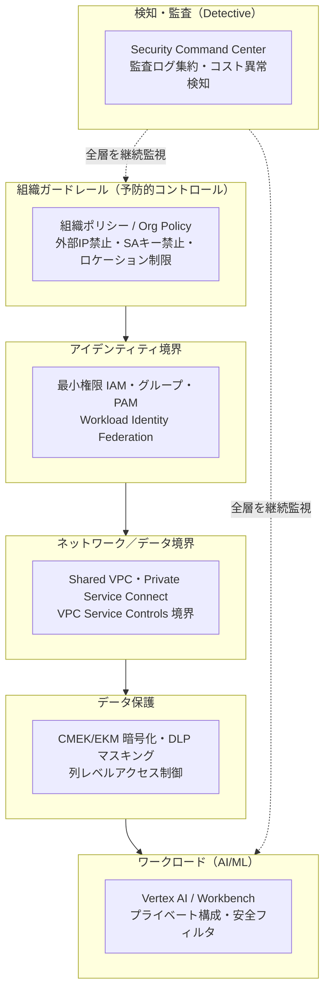

### 1.2 設計の6原則

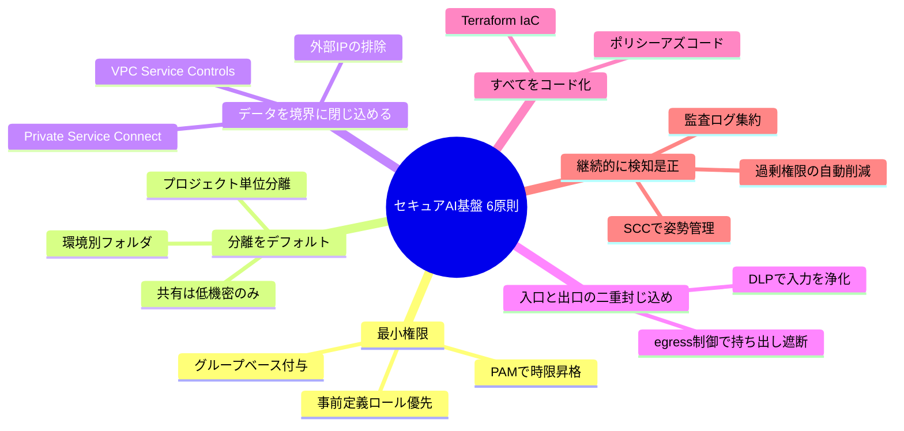

| 原則 | 一言で | 代表的な実装 |
|---|---|---|
| ① 最小権限 | 必要な人に必要な時だけ | 事前定義ロール / グループ / PAM / IAM Conditions |
| ② 分離をデフォルト | 影響範囲（爆発半径）を限定 | プロジェクト単位分離 / 環境別フォルダ |
| ③ データを境界に閉じ込める | 持ち出し経路を構造的に塞ぐ | VPC-SC / PSC / 外部IP禁止 |
| ④ 入口と出口の二重封じ込め | 機密を入れない・出さない | DLP 前処理 / egress 制御 |
| ⑤ すべてをコード化 | 再現性と監査性 | Terraform / Policy as Code |
| ⑥ 継続的に検知・是正 | 設定ミスは必ず起きる前提 | SCC / 監査ログ / IAM Recommender |

---

## 2. 全体アーキテクチャ（鳥瞰図）

基盤全体を「共通サービス層」「ネットワーク層」「AI プロジェクト層」「監視・ガバナンス層」に分けた構成です。

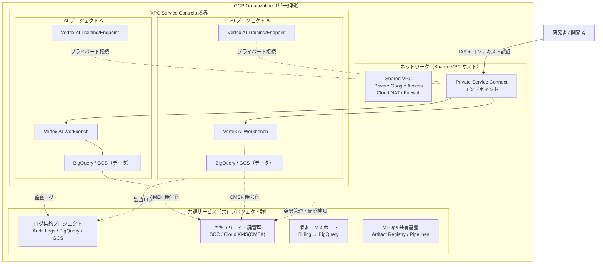

ポイント:

- **研究者は外部 IP を一切持たない**。IAP（Identity-Aware Proxy）＋コンテキストアウェアアクセスで認証し、Private Service Connect 経由で内部接続します。
- **AI プロジェクト群は VPC Service Controls 境界の内側**に置き、データの持ち出しを構造的に遮断します。
- **共通サービス（ログ・鍵・セキュリティ・MLOps）は集約**し、各 AI プロジェクトには持たせません（職務分掌と一元統制）。

---

## 3. リソース階層（組織構造）

### 3.1 推奨フォルダ構成

Google の Enterprise foundations blueprint に沿い、**環境別（dev / nonprod / prod）を最上位の分岐**にして、その下に各 AI プロジェクトを配置します。

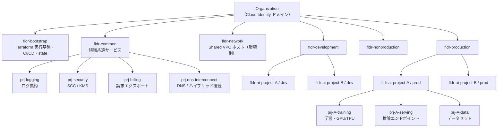

### 3.2 なぜこの構造か

| 設計判断 | 理由 |
|---|---|
| 環境別フォルダを最上位に | フォルダに組織ポリシー/IAM が継承される。prod は厳格、dev は緩和、という**一括強制と例外管理**ができる |
| AI プロジェクトをプロジェクト単位で分離 | プロジェクトが IAM・課金・API・クォータの境界。**爆発半径**を最小化 |
| 学習 / 推論 / データを別プロジェクトに | GPU/TPU クォータ・データアクセス・課金を独立管理。データへのアクセス権を最小化 |
| 共通サービスを集約 | ログ・鍵・セキュリティを一元管理し、改ざん防止と職務分掌を実現 |

> **継承の原則**: 組織ポリシーと IAM ロールは上位（Organization / Folder）から下位（Project）へ自動継承されます。上位で「禁止」を決めれば配下すべてに効きます。

---

## 4. アイデンティティとアクセス管理（IAM）

### 4.1 アクセスの全体像

人間・ワークロード・外部システムで認証方式を分け、**静的な鍵（サービスアカウントキー）を排除**します。

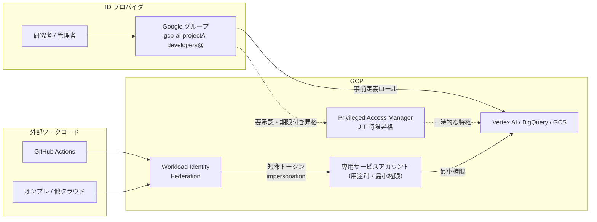

### 4.2 IAM ベストプラクティス一覧

| 項目 | 推奨 | 理由 |
|---|---|---|
| 最小権限 | basic ロール（Owner/Editor/Viewer）を本番で使わない | 過剰権限は侵害時の被害を拡大する |
| ロール選択 | まず事前定義ロール。粒度が合わない時だけカスタムロール | 事前定義は Google が新 API に追従しメンテ不要 |
| 付与単位 | 個人ではなく **Google グループ**に付与 | 入退社・異動を IdP 側で集約管理でき棚卸しが容易 |
| サービスアカウント | 用途別に専用 SA。**デフォルト SA は無効化**、SA 間は impersonation | デフォルト SA は過剰権限。impersonation は鍵を持たず短命 |
| 外部連携 | **Workload Identity Federation**（GitHub/オンプレ/他クラウド）、GKE は Workload Identity | SA キーの発行・保管・ローテーション負担と漏洩リスクを根本除去 |
| SA キー | 原則禁止（組織ポリシーで強制） | 静的な長期鍵は最も漏洩しやすい認証情報 |
| 特権アクセス | **PAM** で Just-In-Time の時限・要承認・要理由の昇格 | 常時特権を排除し、操作を監査ログに残す |
| 条件付与 | **IAM Conditions**（時間帯・リソース・タグ） | 付与を文脈で絞り横展開（lateral movement）を抑止 |
| 継続是正 | **IAM Recommender / Policy Analyzer** | 付与後に肥大化する権限を定期的に自動削減 |

### 4.3 組織ポリシー（予防的ガードレール）の代表例

フォルダ/プロジェクトに継承させ「そもそも作らせない」制約を効かせます。

| 目的 | constraint 名 |
|---|---|
| 外部 IP 禁止（VM） | `constraints/compute.vmExternalIpAccess` |
| SA キー作成禁止 | `constraints/iam.disableServiceAccountKeyCreation` |
| SA キーアップロード禁止 | `constraints/iam.disableServiceAccountKeyUpload` |
| ドメイン制限共有 | `constraints/iam.allowedPolicyMemberDomains` |
| リソースロケーション制限 | `constraints/gcp.resourceLocations` |
| 公開アクセス防止（Storage） | `constraints/storage.publicAccessPrevention` |
| 均一バケットレベルアクセス強制 | `constraints/storage.uniformBucketLevelAccess` |
| 公開 IP 付与禁止（Cloud SQL 等） | `constraints/sql.restrictPublicIp` |
| Shielded VM 必須 | `constraints/compute.requireShieldedVm` |
| OS Login 強制 | `constraints/compute.requireOsLogin` |
| デフォルト SA への自動権限付与の無効化 | `constraints/iam.automaticIamGrantsForDefaultServiceAccounts` |

> **カスタム組織ポリシー（Custom Constraints, CEL）**で「Vertex AI を特定リージョンのみ許可」など独自ルールも定義できます。

---

## 5. ネットワークとデータ境界

### 5.1 VPC Service Controls を中核に据える

IAM は「誰が許可されているか」を制御しますが、**認証情報が漏れた場合や内部者によるデータの持ち出しは防げません**。VPC Service Controls（VPC-SC）は、サービス境界によってデータの移動経路そのものを制限します。

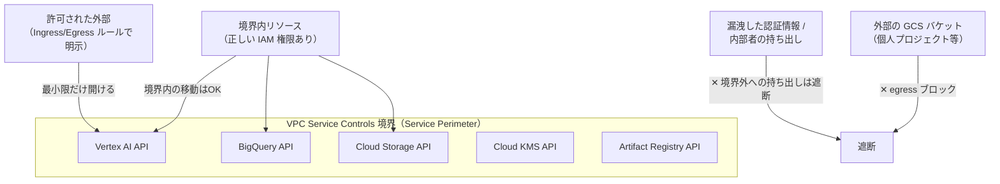

| 機能 | 役割 |
|---|---|
| サービス境界 | 保護対象プロジェクト群と API を囲む仮想境界。境界外へデータを持ち出せない |
| Ingress / Egress ルール | 出入りを identity・リソース・API メソッド単位で明示許可（デフォルト拒否） |
| アクセスレベル | IP 範囲・デバイス状態・地域などの条件（Access Context Manager で定義） |
| 境界ブリッジ | 複数境界間で特定リソースを限定共有 |
| **dry-run モード** | 違反をログ記録するがブロックしない試験モード。**本番適用前に必須** |

> **重要な実務手順**: いきなり enforced にすると正規ワークロードが止まります。まず **dry-run** で監査ログから実際に呼ばれた API メソッドを洗い出し、必要な ingress/egress だけを許可してから enforced に移行します。
>
> **Vertex AI 固有**: Vertex AI API を境界に含めると公開エンドポイント経由のアクセスは自動遮断されます。境界内のマネージド実行環境はデフォルトでインターネット非接続になるため、pip パッケージ取得などの外部 egress が必要なら PSC 経由で明示的に構成します。

### 5.2 プライベート接続と外部 IP の排除

通信を Google のバックボーン内に閉じ込め、パブリックインターネットから切り離します。

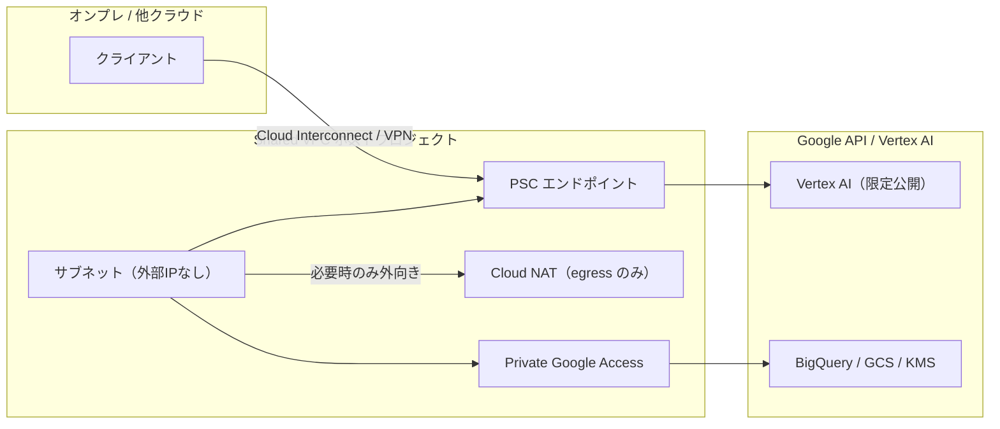

| 製品/機能 | 役割 | なぜ |
|---|---|---|
| Shared VPC | ネットワークを中央のホストプロジェクトで一元管理 | 各チームに分散させず統制を集約 |
| Private Google Access | 外部 IP なしの VM から Google API へ内部経路 | 攻撃面を縮小しつつ API 利用 |
| Private Service Connect (PSC) | 内部 IP で Vertex AI 等へ接続（推移的・IP 効率的） | インターネット非経由。VPC-SC + インターネット必要時は PSC インターフェース必須 |
| 限定公開エンドポイント | 推論/学習を内部 IP で公開 | トラフィックがインターネットを経由しない |
| 外部 IP の排除 | 組織ポリシーで強制 | 持ち出し経路と直接攻撃面を排除 |
| Cloud NAT | 受信を許さず egress のみ制御 | 必要時だけ外向き通信 |
| 階層型ファイアウォールポリシー | デフォルト拒否＋最小許可 | 東西/南北トラフィックの最小化 |
| Cloud Armor | 公開部分（あれば）の WAF / DDoS 防御 | 露出面を限定し L7 防御 |

---

## 6. データ保護と暗号化

### 6.1 暗号化レイヤと鍵管理の選択

GCP は**デフォルトで全データを保存時暗号化**しますが、鍵の管理権限を顧客が握りたい場合に CMEK 以上を使います。機密度に応じて方式を選びます。

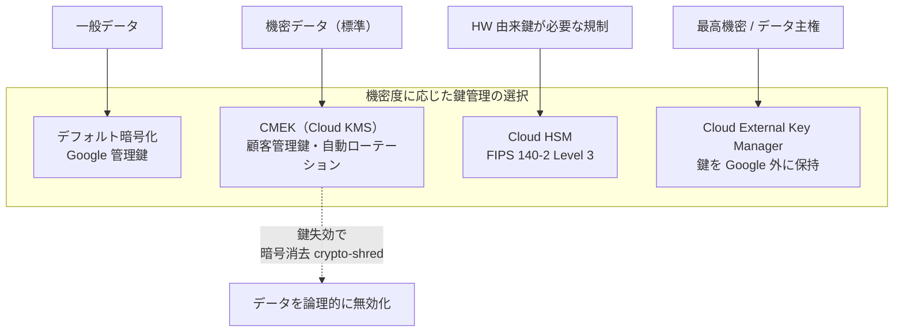

| 方式 | どんな機密度で使うか | 注意点 |
|---|---|---|
| デフォルト暗号化 | 一般データのベースライン | 設定不要 |
| CMEK（Cloud KMS） | **機密データの標準** | 鍵の自動ローテーション推奨。鍵失効で即時に復号不能化 |
| CSEK（顧客提供鍵） | 鍵を一切 Google に保管させたい限定ケース | 運用負荷が大きい |
| Cloud HSM | HW 由来の鍵が必要な規制 | マルチテナント HSM 上の CMEK が標準的推奨 |
| Cloud EKM | 最高機密・データ主権 | 手動管理の外部鍵は自動ローテーション非対応。外部 KMS 側も監査ログ必須 |

> **職務分掌**: 鍵を管理するプロジェクト（prj-security）と、暗号化されるリソースを置くプロジェクトを**分離**します。鍵へのアクセスは IAM で最小化し、利用は監査ログで監視します。

### 6.2 機密データの発見・分類・マスキング（Sensitive Data Protection）

「どこに何の機密データがあるか分からない」状態を解消し、生の PII（個人情報）を R&D 利用から隔離します。

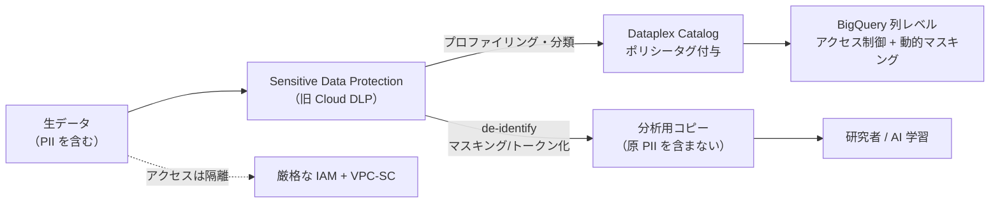

| 機能 | 役割 |
|---|---|
| Sensitive Data Protection (SDP) | PII を infoType で自動検出し、マスキング/トークン化/暗号化で de-identify |
| Dataplex Universal Catalog | SDP の結果をタグとして付与し、組織横断のガバナンスへ連携 |
| BigQuery 列レベルアクセス制御 | ポリシータグで機密列だけを保護。残りは自由に分析 |
| 動的データマスキング | 権限不足のユーザーには NULL/ハッシュ/デフォルト値を返す |

### 6.3 ストレージのガードレール

| 対象 | 設定 | 理由 |
|---|---|---|
| Cloud Storage | 公開アクセス防止 + 均一バケットレベルアクセスを**組織ポリシーで強制** | 誤公開を構造的に不可能化、ACL 抜けを防止 |
| Cloud Storage | オブジェクトバージョニング + 保持ポリシー / Bucket Lock | 誤削除・改ざん・ランサム対策、WORM 要件 |
| Cloud Storage | 署名付き URL は有効期限を最短に・発行を限定 | 長期/広範な署名付き URL は VPC-SC を迂回する持ち出し経路になり得る |
| BigQuery | データセット/テーブル/列/行レベル制御 + CMEK + VPC-SC | 機密列のみ保護しつつ分析を許可 |
| ライフサイクル | 自動削除/階層移行・パーティション有効期限 | データ滞留＝リスクを最小化 |

### 6.4 アクセス境界の追加（ゼロトラスト）

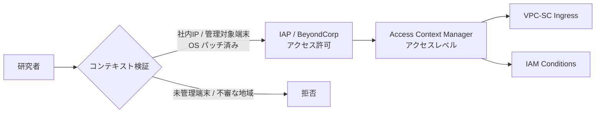

- **Access Context Manager**: IP・地域・デバイス状態・時間などの条件（アクセスレベル）を定義し、VPC-SC の ingress と IAM Conditions の双方から参照。
- **BeyondCorp Enterprise / IAP**: VPN レスのゼロトラスト接続。SSH/RDP も外部 IP なしで提供（IAP-TCP）。
- **コンテキストアウェアアクセス**: 管理対象・暗号化・パッチ済みなどデバイス状態を条件化し、未管理端末からのアクセスをブロック。

---

## 7. AI/ML プラットフォームのセキュリティ

### 7.1 対話的開発環境（Workbench / Colab Enterprise）の安全な提供

研究者が日常的に使うノートブック環境は、**データ持ち出しの最大の発生源**になりがちです。

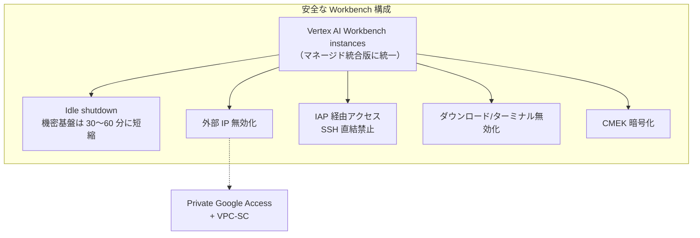

| 設定 | 推奨 | 理由 |
|---|---|---|
| 環境の種類 | Workbench instances（マネージド統合版）に統一 | 自動パッチで攻撃面を削減 |
| Idle shutdown | デフォルト有効。機密基盤は 30〜60 分 | アイドル環境は監視されない攻撃対象＋課金浪費 |
| 外部 IP | 無効化（Private Google Access + IAP） | 直接到達と持ち出し経路を遮断 |
| アクセス経路 | SSH 直結禁止、IAP トンネル経由 | コンテキスト条件で認証認可を一元化 |
| ダウンロード | ノートブックのダウンロード/ターミナルを無効化 | ローカルへのデータ吸い出しを防ぐ |
| Colab Enterprise | VPC-SC 境界内・組織管理ランタイム・CMEK | 手軽な UX と分離/暗号化/監査を両立 |

### 7.2 生成 AI / 基盤モデル（Gemini / Model Garden）の利用

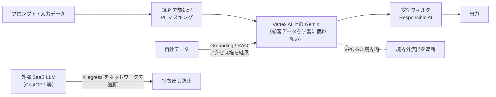

- **Vertex AI 上の Gemini は、入力した顧客データを Google の公開モデルの学習に使いません**。これがコンシューマ向けアプリや外部 SaaS LLM との決定的な差です。
- **データレジデンシー**: 保存に加え ML 処理（推論）リージョンを指定可能。ただし Grounding with Google Search や一部 RAG/Tuning 機能はレジデンシー保証の対象外になる場合があるため、利用前に確認します。
- **二重の封じ込め**: DLP で入口（機密の流入）を絞り、VPC-SC で出口（境界外流出）を絞ります。
- **承認済み LLM は Vertex AI のみ**と定め、外部 SaaS LLM ドメインへの egress を Secure Web Proxy / NGFW で遮断します。

### 7.3 MLOps とサプライチェーンのセキュリティ

AI の成果物はデータ・コード・コンテナ・モデル重みの合成物です。各段で署名・スキャン・系譜を残します。

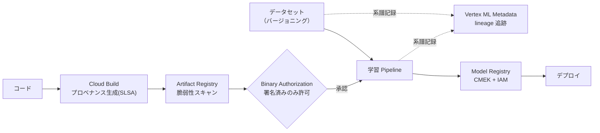

| 対策 | 役割 |
|---|---|
| Vertex ML Metadata | データ→学習→モデル→デプロイの系譜を自動記録。インシデント追跡 |
| Artifact Registry + Artifact Analysis | コンテナ/パッケージを一元管理し CVE を検出 |
| Binary Authorization | 署名済み・承認済みコンテナのみデプロイ許可 |
| Cloud Build プロベナンス（SLSA） | ビルドの出所を検証可能に |
| 再現性 | コンテナをタグでなく `@sha256` で固定、データセットをバージョニング |

### 7.4 AI 固有のリスクと対策

| リスク | 対策 |
|---|---|
| 学習データからの情報漏洩（memorization） | 学習前に DLP で de-identify、出力ログの監査、データ分類とアクセス権の継承 |
| モデル重みの保護 | Model Registry を CMEK + VPC-SC 境界内に。エクスポート権限を厳格な IAM に限定 |
| プロンプトインジェクション | 入力サニタイズ、システムプロンプトと外部入力の分離、エージェント権限の最小化、安全フィルタ |
| シャドー AI | 組織ポリシーで承認外サービスを遮断、egress 制御、課金/API 利用の可視化で検出 |
| 研究者が外部 SaaS LLM に機密を貼り付け | **最大級のリスク**。承認済みは Vertex AI のみと定め、外部 LLM ドメインへの egress をブロック。安全な代替（Vertex AI）を用意することが最大の抑止 |

---

## 8. ガバナンス・監視・運用

### 8.1 ログ集約と監査

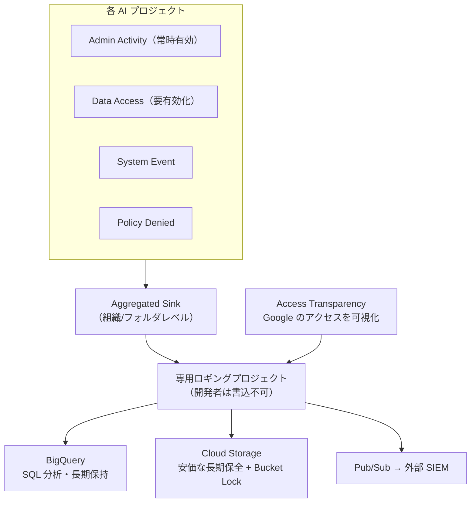

| ログ種別 | 既定 | 推奨 |
|---|---|---|
| Admin Activity | 常時有効・無効化不可 | そのまま集約 |
| **Data Access** | **デフォルト無効**（BigQuery 除く） | **機密データプロジェクトで有効化**。「誰がいつどの機密データにアクセスしたか」を記録する唯一の手段 |
| System Event | 有効 | 集約 |
| Policy Denied | 有効 | 集約（拒否されたアクセスの可視化） |

- **Aggregated Sinks** を組織/フォルダレベルで設定し、配下全プロジェクトのログを専用ロギングプロジェクトに一元集約します（個別設定の漏れ防止）。
- ログバケットを **CMEK 暗号化 + 保持期間 + Bucket Lock** で改ざん不能な証跡にします。
- **Access Transparency / Access Approval** で、Google サポート/運用担当による顧客データアクセスまで可視化・事前承認します。

### 8.2 脅威検知と姿勢管理（Security Command Center）

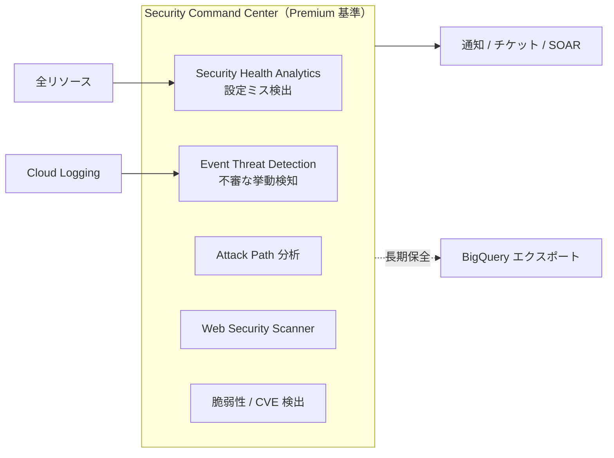

- **SCC Premium を基準**に、設定ミス（公開バケット・過剰 IAM・暗号化漏れ）と脅威（不審な IAM 付与・持ち出し兆候）を常時自動検知します。
- 注意（2025〜2026）: 新規有効化では findings 保持が **90 日**に短縮されたため、長期保全が必要なら BigQuery へエクスポートします。Enterprise ティアは **2027/5/21 終了予定**で Premium へ移行されます。

### 8.3 コンプライアンスとデータ主権

| 機能 | 役割 |
|---|---|
| Assured Workloads（Japan Data Boundary 等） | データ所在を東京/大阪に限定。Access Transparency/Approval を付与 |
| ISMAP | 日本の政府・公共調達向け。登録範囲のサービスを使う設計 |
| 各種認証（ISO 27001/27017/27018/27701, SOC 1/2/3 等） | 対外説明・監査対応の根拠 |
| 組織ポリシー `gcp.resourceLocations` | リソース作成リージョンを国内等に強制 |

### 8.4 運用・インシデント対応

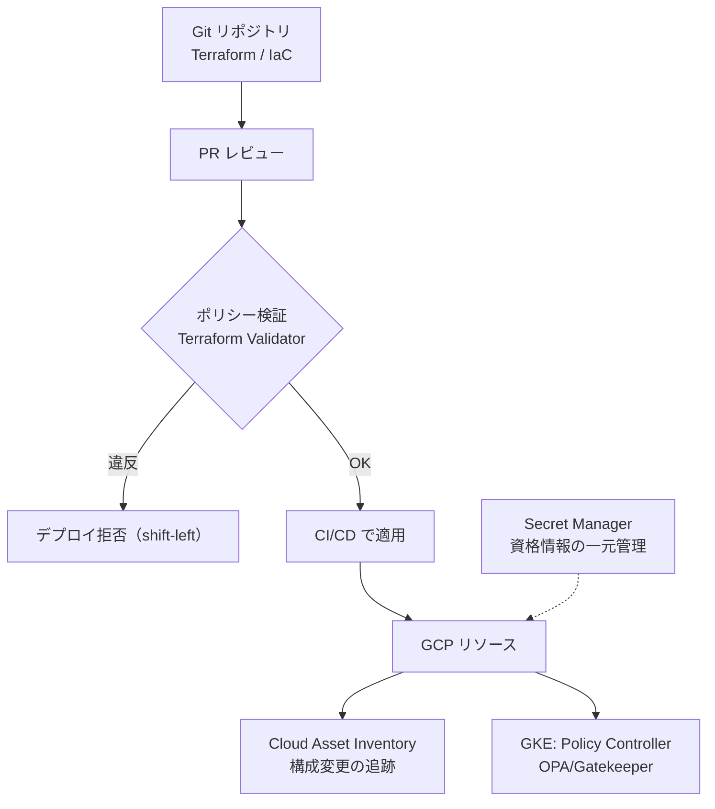

| 項目 | 推奨 |
|---|---|
| IaC | 全構成を Terraform 化し、レビュー・差分・再現性を担保 |
| ポリシーアズコード | 組織ポリシー + Terraform Validator（デプロイ前検証）+ GKE は Policy Controller |
| シークレット管理 | Secret Manager に一元化（自動ローテーション・CMEK・監査ログ）。ノートブックへのハードコードを排除 |
| 構成追跡 | Cloud Asset Inventory で「いつ何が変わったか」を追跡しロールバック |
| 権限の継続是正 | IAM Recommender / Policy Analyzer で過剰権限を定期削減 |
| 特権アクセス | PAM で Just-In-Time 昇格（一部機能は GA 状況を要確認） |

---

## 9. 複数 AI プロジェクトの分離パターン

3つの選択肢とトレードオフです。**AI R&D では「フォルダ（環境/チーム）× プロジェクト単位分離」のハイブリッドが定石**です。

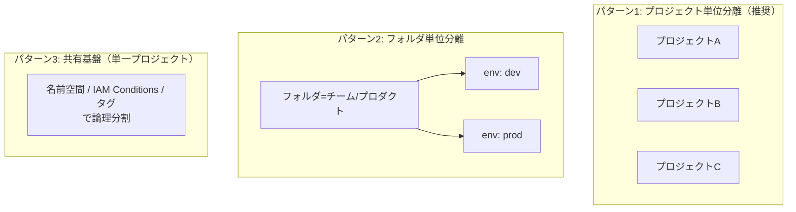

| 選択肢 | 長所 | 短所 | 適する場面 |
|---|---|---|---|
| プロジェクト単位分離 | IAM/課金/クォータ/データの強い境界。爆発半径が最小 | プロジェクト数増で管理オーバーヘッド | **標準推奨**。独立した AI チーム/実験 |
| フォルダ単位分離 | ポリシー/IAM をフォルダで一括継承。組織的にスケール | 深いネストは見通し低下 | 部門・プロダクトが複数あり階層管理したい |
| 共有基盤（マルチテナント） | コスト効率・基盤共有が容易 | 分離が弱く誤設定で他テナントへ波及。課金分離が難しい | 信頼できる小規模・社内のみ・コスト最優先 |

**共有 Feature Store / Model Registry の是非**:

- **共有が妥当**: 全社共通・低機密の特徴量や承認済み基盤モデルを再利用したい場合（厳格な IAM と横断ガバナンスが前提）。
- **分離すべき**: 機密区分が異なる、規制データを含む、チーム間に信頼境界が必要な場合。**機密データの特徴量・モデルは共有ストアに入れない**のが安全側。
- **現実解**: 「共有レジストリ＝承認済み公開可能モデルのカタログ」、「機密モデル＝プロジェクト内に隔離」のハイブリッド。

> **原則**: 分離をデフォルトにし、共有は明示的にガバナンスされた低機密領域に限定する。共有は再利用効率を生むが、機密区分をまたいだ共有は「最弱リンク」で全体が漏れる。

---

## 10. コスト管理とガードレール

AI ワークロードは GPU/TPU により突発的に高額化します。多層のガードレールで暴走を防ぎます。

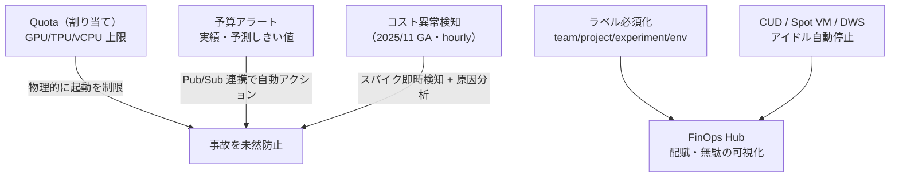

| 手段 | 役割 |
|---|---|
| Quotas | GPU/TPU・vCPU・API の上限設定。**大量 GPU 誤起動を物理的に防ぐ最重要ガードレール** |
| 予算アラート | 実績・予測ベース通知。Pub/Sub で自動アクション |
| コスト異常検知（GA） | 時間単位でスパイク検知し、原因の Service/Region/SKU を特定 |
| 課金の分離 | 本番/実験/チームごとにプロジェクト/請求先を分け正確に配賦 |
| ラベル付け + FinOps Hub | 必須ラベルで配賦、アイドル GPU 等の無駄を可視化 |
| アクセラレータ最適化 | Committed Use Discounts / Spot VM / Dynamic Workload Scheduler / バッチ化 |

---

## 11. セキュリティ チェックリスト

導入時の確認項目です。各項目は本文の該当章を参照してください。

### 組織・IAM（3〜4章）
- [ ] 単一 Organization・環境別フォルダ階層を構築した
- [ ] AI プロジェクトをプロジェクト単位で分離した（学習/推論/データも分割）
- [ ] basic ロール（Owner/Editor）を本番で使っていない
- [ ] IAM はグループベースで付与している
- [ ] SA キーを禁止し Workload Identity Federation を使っている
- [ ] PAM で特権を Just-In-Time 化した
- [ ] 組織ポリシー（外部IP禁止・SAキー禁止・公開防止・ロケーション制限）を適用した

### ネットワーク・データ境界（5章）
- [ ] VPC Service Controls 境界を設定した（Vertex AI/BigQuery/GCS/KMS を含む）
- [ ] **dry-run から開始**し、ingress/egress を最小化した
- [ ] Private Service Connect + Private Google Access で公開エンドポイントを排除した
- [ ] 外部 IP を組織ポリシーで禁止した

### データ保護（6章）
- [ ] 機密データを CMEK（必要に応じ HSM/EKM）で暗号化した
- [ ] 鍵管理プロジェクトと暗号化リソースを分離した
- [ ] DLP で PII を発見・分類・de-identify した
- [ ] BigQuery 列レベルアクセス制御 + 動的マスキングを適用した
- [ ] GCS の公開防止 + 均一バケットレベルアクセスを強制した

### AI/ML（7章）
- [ ] Workbench を外部IP無効・IAP接続・ダウンロード無効・idle shutdown 短縮で構成した
- [ ] 承認済み LLM を Vertex AI のみに限定し、外部 SaaS LLM への egress を遮断した
- [ ] DLP でプロンプト前処理を行っている
- [ ] Model Registry を CMEK + VPC-SC で保護し、エクスポート権限を限定した
- [ ] Artifact Registry スキャン + Binary Authorization + SLSA を構成した

### ガバナンス・運用（8章）
- [ ] Security Command Center（Premium 基準）を有効化した
- [ ] Data Access ログを機密プロジェクトで有効化した
- [ ] Aggregated Sink で専用ロギングプロジェクトに集約した（CMEK + Bucket Lock）
- [ ] Access Transparency / Approval を有効化した
- [ ] 全構成を Terraform 化し、デプロイ前ポリシー検証を入れた
- [ ] Secret Manager に資格情報を一元化した

### コスト（10章）
- [ ] GPU/TPU の Quota 上限を設定した
- [ ] 予算アラート + コスト異常検知を設定した
- [ ] 必須ラベルで配賦できるようにした

---

## 12. 段階的導入ロードマップ

一度に全部は構築できません。基盤（土台）→ ネットワーク/データ境界 → AI ワークロード → 運用高度化、の順で積み上げます。

```mermaid
flowchart LR
    subgraph PHASE1["フェーズ1: 基盤"]
        F1A["組織/フォルダ階層"]
        F1B["IAM/グループ/組織ポリシー"]
        F1C["Terraform 基盤 + ログ集約"]
    end
    subgraph PHASE2["フェーズ2: 境界"]
        F2A["Shared VPC / PSC"]
        F2B["VPC-SC（dry-run→enforced）"]
        F2C["CMEK 鍵管理"]
    end
    subgraph PHASE3["フェーズ3: AI"]
        F3A["Vertex AI プライベート構成"]
        F3B["Workbench / Colab 安全化"]
        F3C["DLP + 承認済み LLM 限定"]
        F3D["MLOps サプライチェーン"]
    end
    subgraph PHASE4["フェーズ4: 運用高度化"]
        F4A["SCC Premium 姿勢管理"]
        F4B["PAM / 権限継続是正"]
        F4C["コスト最適化 / FinOps"]
        F4D["コンプライアンス（Assured Workloads）"]
    end
    PHASE1 --> PHASE2 --> PHASE3 --> PHASE4
```

| フェーズ | ゴール | 主な成果物 |
|---|---|---|
| 1. 基盤 | 安全なアカウント土台 | 組織階層・IAM・組織ポリシー・IaC・ログ集約 |
| 2. 境界 | データを境界に閉じ込める | Shared VPC・PSC・VPC-SC・CMEK |
| 3. AI | 安全に AI 開発を始める | Vertex AI プライベート化・Workbench 安全化・DLP・MLOps |
| 4. 運用高度化 | 継続的な検知と最適化 | SCC・PAM・FinOps・コンプライアンス |

> 各フェーズで「dry-run で検証 → 小さく適用 → 監査ログで確認 → 横展開」を繰り返します。特に VPC-SC は必ず dry-run から始めます。

---

## 13. 付録: 主要サービス早見表と参照リンク

### 13.1 目的別 主要 GCP サービス早見表

| 目的 | サービス / 機能 |
|---|---|
| リソース階層・ガードレール | Resource Manager / Organization Policy Service |
| ID・アクセス | Cloud IAM / Cloud Identity / Workload Identity Federation / Privileged Access Manager |
| データ境界 | VPC Service Controls / Access Context Manager |
| プライベート接続 | Shared VPC / Private Service Connect / Private Google Access / Cloud NAT |
| 暗号化・鍵管理 | Cloud KMS（CMEK）/ Cloud HSM / Cloud External Key Manager |
| 機密データ | Sensitive Data Protection（旧 DLP）/ Dataplex / BigQuery 列レベルセキュリティ |
| ストレージ | Cloud Storage / BigQuery |
| AI/ML 開発 | Vertex AI Workbench / Colab Enterprise / Vertex AI Training・Pipelines |
| 生成 AI | Vertex AI（Gemini / Model Garden / Grounding） |
| MLOps | Vertex ML Metadata / Model Registry / Feature Store / Artifact Registry / Binary Authorization |
| ゼロトラスト | BeyondCorp Enterprise / Identity-Aware Proxy |
| 脅威検知・姿勢管理 | Security Command Center |
| ログ・監査 | Cloud Audit Logs / Aggregated Sinks / Access Transparency・Approval |
| 監視 | Cloud Monitoring / Cloud Logging |
| コンプライアンス | Assured Workloads / ISMAP |
| コスト | Budgets / Quotas / Cost Anomaly Detection / FinOps Hub |
| IaC・ポリシー | Terraform / Terraform Validator / Policy Controller / Cloud Asset Inventory |
| シークレット | Secret Manager |

### 13.2 主な公式参照リンク（cloud.google.com）

**基盤・組織**
- Enterprise foundations blueprint: https://cloud.google.com/architecture/blueprints/security-foundations
- 組織構造（blueprint）: https://cloud.google.com/architecture/blueprints/security-foundations/organization-structure
- ランディングゾーンのリソース階層: https://cloud.google.com/architecture/landing-zones/decide-resource-hierarchy
- 組織ポリシー制約リファレンス: https://cloud.google.com/organization-policy/reference/org-policy-constraints
- Privileged Access Manager: https://cloud.google.com/iam/docs/pam-overview
- Workload Identity Federation ベストプラクティス: https://cloud.google.com/iam/docs/best-practices-for-using-workload-identity-federation

**データ境界・暗号化**
- VPC Service Controls × Vertex AI: https://cloud.google.com/vertex-ai/docs/general/vpc-service-controls
- VPC-SC Ingress/Egress ルール: https://cloud.google.com/vpc-service-controls/docs/ingress-egress-rules
- CMEK ベストプラクティス: https://cloud.google.com/kms/docs/cmek-best-practices
- Cloud External Key Manager: https://cloud.google.com/kms/docs/ekm
- Sensitive Data Protection（データリスク低減）: https://cloud.google.com/sensitive-data-protection/docs/best-practices-for-mitigating-data-risk
- BigQuery 列レベルセキュリティ: https://cloud.google.com/bigquery/docs/column-level-security
- 機密データウェアハウス blueprint: https://cloud.google.com/architecture/blueprints/confidential-data-warehouse-blueprint

**AI/ML**
- Vertex AI 生成 AI データレジデンシー: https://cloud.google.com/vertex-ai/generative-ai/docs/learn/data-residency
- Workbench instances idle shutdown: https://cloud.google.com/vertex-ai/docs/workbench/instances/idle-shutdown
- PSC エンドポイント経由の Vertex AI アクセス: https://cloud.google.com/vertex-ai/docs/general/psc-endpoints
- Gemini for Google Cloud のデータの扱い: https://cloud.google.com/gemini/docs/discover/data-governance

**ガバナンス・運用**
- Security Command Center サービスティア: https://cloud.google.com/security-command-center/docs/service-tiers
- Assured Workloads（Japan Data Boundary）: https://cloud.google.com/assured-workloads/docs/control-packages/japan-regions
- ISMAP コンプライアンス: https://cloud.google.com/security/compliance/ismap
- コスト異常検知の GA: https://cloud.google.com/blog/topics/cost-management/announcing-ga-of-cost-anomaly-detection

---

> **免責**: 本資料は 2026 年 6 月時点の公式ドキュメントおよび一般的なベストプラクティスに基づく設計指針です。GCP のサービス名・機能・GA 状況・リージョン対応・課金は変更されます（特に Vertex AI 系は四半期単位で更新）。実装前に必ず最新の公式ドキュメントで対象範囲を確認してください。
