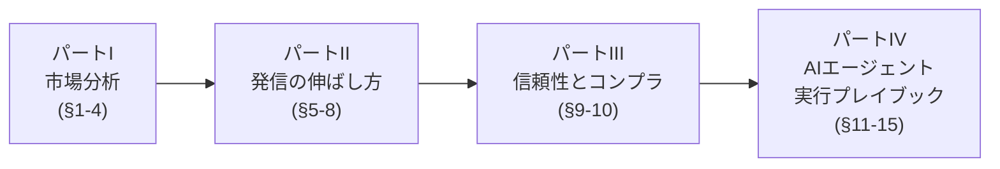
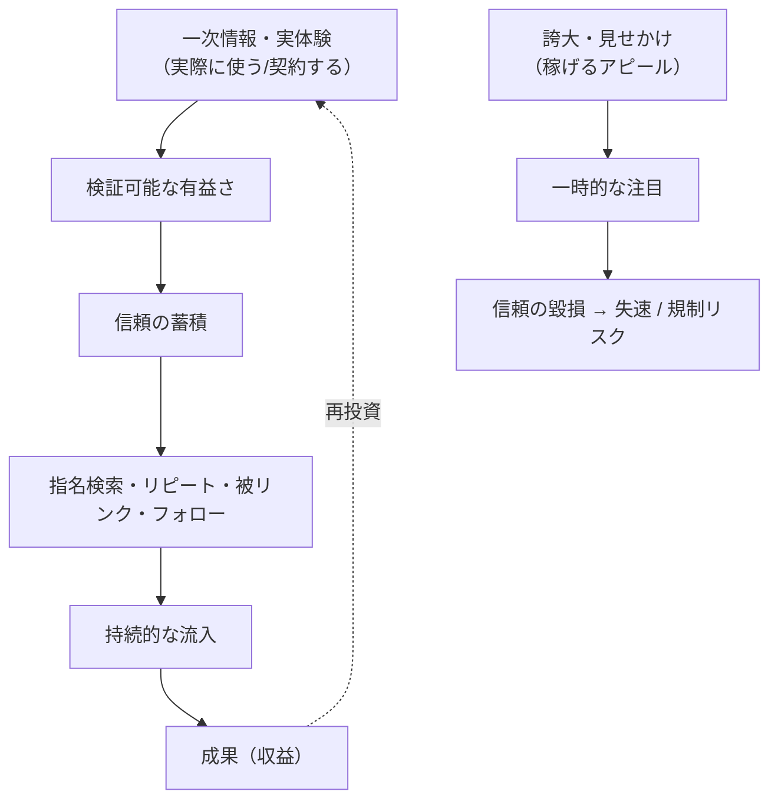
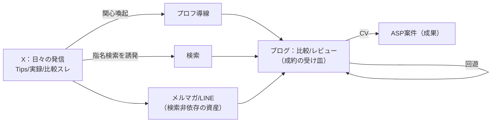
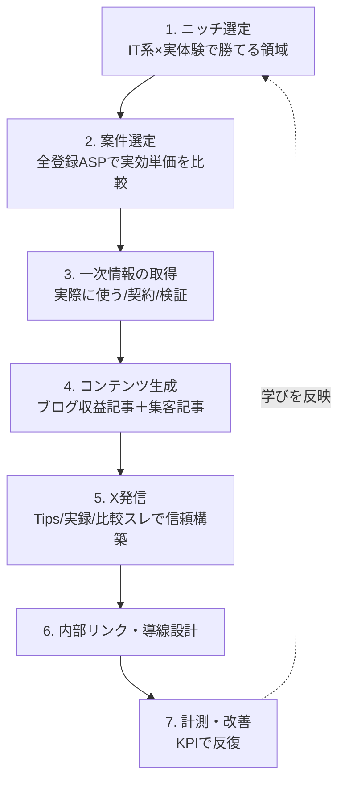
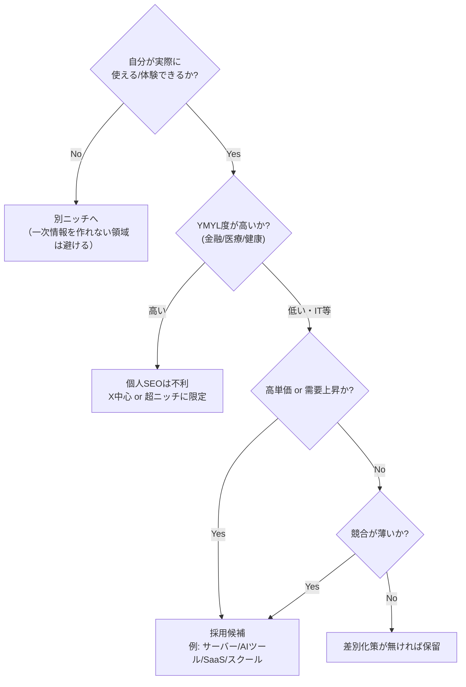

# IT系アフィリエイト 発信戦略ガイド（AIエージェント活用前提）

このドキュメントは、**IT領域を主軸にアフィリエイトを始め・伸ばす**ための実践資料です。前半は市場・競合の「分析」、後半はAIエージェントがそのまま発信に使える「実行プレイブック」（ルール・テンプレート・チェックリスト）で構成しています。重視チャネルは **X（旧Twitter）と ブログ/SEO** です。

---

## 0. このドキュメントの使い方（重要）

### 0.1 想定読者
- このガイドを運用する人間
- 将来このファイルを読んで発信業務を補助する**AIエージェント**（だから各章に「機械的に使えるルール・テンプレ・チェックリスト」を置いています）

### 0.2 全体を貫く前提：「見せかけ」を除外する
本ガイドは、**「実際には稼げていないのに稼げている風」の発信を分析対象から除外**します。判断基準は §9 の「本物 vs 見せかけ 判定チェックリスト」に集約しています。要点だけ先に：

> **収益源が「"稼ぐ系"の商材・サロン・教材の販売」に偏っている発信者は、手本にしない。**
> 彼らの「伸びるノウハウ」は「ノウハウを売るためのノウハウ」であって、実際の物販・サービス送客で稼ぐ手法とは別物。再現性・透明性・長期運用の裏付けがある発信者だけを参考にする。

### 0.3 データ鮮度の注意（必読）
本書の **報酬単価・承認率・案件の有無などの数値は変動が激しい**ため、本文中で示す金額は「目安レンジ」です。実行前に必ず各ASPの公式案件ページで最新値を確認してください（確認先は §15）。法令（特にステマ規制）は §10 の出典で最新を確認すること。

### 0.4 ドキュメントの地図



---

# パート I. 市場分析

## 1. 日本のアフィリエイト市場とASPの全体像

### 1.1 ASPの種類

| 種類 | 説明 | 代表例 |
|---|---|---|
| 総合オープンASP | 誰でも登録でき、幅広いジャンルを扱う | A8.net、もしもアフィリエイト、afb（アフィb）、アクセストレード、バリューコマース、JANet |
| 物販系 | 物理/デジタル商品をECで紹介 | Amazonアソシエイト、楽天アフィリエイト、もしも（楽天/Amazon/Yahoo!を一括管理可） |
| クローズドASP | 招待制。高単価・独占案件が多い | レントラックス、felmat（フェルマ）、TCSアフィリエイト |
| 情報商材系 | 教材・ノウハウ販売（**高単価だが玉石混交**） | インフォトップ 等 |
| 各サービスの直接提携 | SaaS等が自前で運営する紹介/パートナー制度 | 各種SaaS・クラウドの紹介プログラム |

> **IT系での基本姿勢**: メインは A8.net など総合ASPで案件数を確保しつつ、**高単価はクローズドASP**、**物販（ガジェット）は Amazon/楽天（もしも経由が便利）**、**SaaSは公式の直接提携**を組み合わせる、が定石です。

### 1.2 収益化のモデル（成果の発生条件）

| 成果条件 | 難易度 | 単価傾向 | 初心者向き |
|---|---|---|---|
| クリック（インプレッション/クリック報酬） | 低 | 低 | ○ |
| 無料登録・無料体験・資料請求 | 中 | 中 | ◎（成約しやすい） |
| 物販（商品購入の%） | 中 | 低〜中 | ○ |
| 有料申込・購入（サーバー契約、スクール入会等） | 高 | 高 | △（成約に信頼が必要） |

**初心者の入り口戦略**: まず「無料登録・無料体験」で成果点（コンバージョンポイント）が手前にある案件で成功体験を作り、信頼と流入が育ったら「高単価の有料申込」へ広げる。

---

## 2. ①テーマ/ジャンル幅広調査（A8・もしも等に共通する主要ジャンル）

A8.net・もしもアフィリエイトを含む総合ASPで扱われる主要ジャンルの俯瞰です。**金額は目安レンジ（要確認）**。

| ジャンル | 需要 | 単価傾向 | 競合 | 初心者 | 代表案件・備考 |
|---|---|---|---|---|---|
| 美容・コスメ | 非常に高 | 中〜高 | 激戦 | △ | スキンケア、化粧品。**薬機法に最大級の注意**（§10） |
| 健康・サプリ・ダイエット | 非常に高 | 中〜高 | 激戦 | △ | YMYL領域。薬機法・景表法に注意 |
| 金融（クレカ・証券・FX・ローン） | 高 | **高** | 激戦 | △ | 高単価だが審査・YMYLで上位表示が難しい |
| 転職・求人 | 高 | 中〜高 | 激戦 | △〜○ | エージェント登録で成果。IT転職に派生可（§3） |
| 動画配信（VOD）・サブスク | 高 | 低〜中 | 多い | ◎ | 無料体験で成果が出やすく**初心者の登竜門** |
| 通信（格安SIM・光回線・WiFi） | 高 | 中〜高 | 激戦 | △ | 単価高めだが承認が厳しめ |
| 教育・資格・スクール | 高 | 中〜高 | 多い | ○ | プログラミングスクールはIT系へ（§3） |
| 暮らし・生活（電気/ガス、宅食、家事代行） | 中〜高 | 中 | 中 | ○ | 比較需要が安定 |
| 恋愛・マッチング | 中〜高 | 中 | 多い | △ | 規約・媒体審査が厳しめ |
| ペット・趣味・旅行 | 中 | 低〜中 | 中 | ○ | 体験ベースで書きやすい |
| **IT・ガジェット・Webサービス** | 高 | 中〜**高** | 中 | ○ | 本ガイドの主軸（§3・§4） |

### 2.1 伸びている / 飽和の見分け
- **伸びている（2024-2026の傾向）**: AIツール／SaaS／業務効率化、サブスク全般、電気・ガスなど比較系、IT教育・リスキリング。
- **飽和・難化（レッドオーシャン）**: 金融、美容・健康（YMYL）、格安SIM。**個人が検索上位を取りにくい**領域。新規参入なら避けるか、X等の別チャネルや超ニッチで攻める。

> **YMYL（Your Money or Your Life）注意**: 金融・健康・医療など「人生やお金に重大な影響を与える」テーマは、Googleが特に高い専門性・信頼性を要求するため、**個人ブログのSEOでは勝ちにくい**。IT系はYMYL度が比較的低く、個人でも実体験で差別化しやすい——これがIT系を選ぶ大きな利点です。

#### 【調査による裏付け】高単価ジャンル＝稼げる、ではない（出典は §16）

複数の業界ソースで「金融は高単価だが個人には不向き」という見立てが一致しています。金額は目安（時期・特単・ASPで変動／要確認）。

| ジャンル | 報酬目安/件 | 競合 | 初心者 | 注意点 |
|---|---|---|---|---|
| クレジットカード | 約1,500〜12,000円（中心約5,000円、A8公式の平均は約3,065円） | 激戦 | △ | 成果地点は「発行」。審査落ち・重複申込・短期解約・利用額未達で**否認**が多く、承認率が読みにくい |
| FX（国内） | 口座開設＋取引完了で1〜2万円規模 | 激戦 | × | 「取引完了」が条件で難度高 |
| FX（海外） | CPA最大5万円 or IB（取引高連動） | 激戦 | × | 登録だけでは報酬ゼロ。法規制注意 |
| 証券・NISA | 数百〜数千円（例：松井500円、野村952円・税抜） | 激戦 | △ | 単価低めだが新NISAでCV件数は取りやすい |
| カードローン | 3,000〜10,000円 | 激戦・最難関 | × | 法規制が厳しく**承認率が低い（10%以下の案件も）** |
| 保険 | 無料相談3,000〜10,000円／一括見積1,000〜2,000円 | 激戦 | △ | 相談・見積型はCVハードル低め |

> **結論**: いずれも `実効収益 = 単価 × 承認率 ×（上位表示・送客できるか）` で見ると、**YMYLは個人に不利**。クレカの「否認条件の多さ＝承認率の不確実性」は、単価の高さが収益に直結しない典型例です。**IT系は一次情報（実使用・スクショ・手順）で差別化でき、YMYL度が低い**ため個人向き——という本ガイドの方針を裏づけます。

---

## 3. ②IT系のジャンル（A8・もしも等）

IT領域に絞ったサブジャンルの俯瞰。**「高単価 × 需要 × 参入余地」の三拍子**で狙い目を判断します。金額は目安レンジ（要確認）。

| サブジャンル | 需要 | 単価目安(要確認) | 競合 | 狙い目度 | 代表案件・備考 |
|---|---|---|---|---|---|
| レンタルサーバー | 高 | 数千〜1万円超/成約 | 多い | ★★★ | ConoHa WING、エックスサーバー、mixhost等。**ブログ開設層と相性最強の定番** |
| ドメイン | 中 | 低〜中 | 中 | ★★ | サーバーとセットで紹介 |
| プログラミングスクール | 高 | **数千〜数万円/成約** | 多い | ★★★ | 高単価。無料カウンセリングで成果点が手前の案件も |
| オンライン学習・教材（Udemy等） | 中〜高 | 低〜中 | 中 | ★★ | 単価低めだが成約しやすい |
| VPN | 中〜高 | 中 | 中 | ★★ | セキュリティ需要。海外サービス紹介も |
| セキュリティソフト | 中 | 中 | 中 | ★★ | 更新・乗り換え需要 |
| SaaS・業務効率化ツール | 中〜高（**上昇中**） | 中〜高 | **少なめ** | ★★★ | 会計、タスク管理、フォーム、メール等。B2B寄りで競合が薄い |
| AIツール（生成AI等） | **急上昇** | 中 | **少ない（先行者利益）** | ★★★ | 2024-2026の伸び筆頭。レビュー需要大 |
| ノーコード/Web制作 | 中 | 中 | 少なめ | ★★ | 制作代行・ツール紹介 |
| クラウド/インフラ | 中 | 中〜高 | 少ない | ★★ | 専門性が高く差別化しやすい |
| ガジェット/PC/周辺機器（物販） | 高 | 物販%（低〜中） | 多い | ★★ | Amazon/楽天。レビューで信頼を出しやすい |
| IT/エンジニア転職 | 高 | **高** | 多い | ★★ | 高単価。実体験があると強い |
| 副業/フリーランス系 | 高 | 中〜高 | 多い | ★★ | "稼ぐ系"に寄りすぎると信頼を損なうので注意 |

### 3.1 IT系で狙うべき優先順位（初心者→中級）
1. **レンタルサーバー＋ブログ開設導線**（自分がブログを始める過程をそのままコンテンツ化＝一次情報になる）
2. **AIツール／SaaSのレビュー**（競合が薄く、実際に使った一次情報で勝てる。先行者利益）
3. **プログラミングスクール／IT転職**（高単価。実体験・取材で信頼を上乗せ）
4. **ガジェット物販**（レビューで土台の信頼を作りつつ、回遊で上記へ送客）

> **IT系の最大の武器は「自分が実ユーザーである」こと**。スクショ、設定手順、つまずき解決、ベンチマークなど**検証可能な一次情報**を出せるので、YMYLほど権威を要求されず、個人でも勝てる。

### 3.2 IT系 主要案件の具体例（A8.net中心・出典は §16／**単価は要検証**）

> **信頼性の前提**: 以下の円単価の多くは、A8.net等が報酬を非ログインで公開しないため**アフィリエイターのまとめ記事由来＝要検証**です（確定値は提携後の管理画面で確認）。また**承認率はA8ではゴールドランク以上しか閲覧できず**、外部からは原則不明です。掲載有無は複数ソースで確認済みのものを記載しています。

**(a) レンタルサーバー／ドメイン**（ブログ開設層と相性最強の定番）

| 案件 | 報酬目安(要検証) | 備考 |
|---|---|---|
| エックスサーバー | スタンダード約5,000円／上位7,500〜10,000円（法人版は最大45,000円との情報） | EPC高めの優良案件評価。公式は単価非公表 |
| ConoHa WING (GMO) | **公式記載「最大10,000円」** | A8・もしも両対応。ビジネスは12ヶ月以上契約が対象 |
| mixhost | 約5,000〜5,500円 | **承認率30%未満との評判（30日返金保証でキャンセル多発）→要注意** |
| ロリポップ! (GMOペパボ) | 初成果550円（増額告知あり） | 低単価だが初心者導線 |
| お名前.com ドメイン | 1,000円以上で110円／移管1,100円／サーバー同時申込3,100円 | ドメイン単体は低単価。サーバー同時で上がる |
| ムームードメイン | WPホスティング契約で3,000円 | お試し後の有料契約のみ成果 |

**(b) プログラミングスクール／オンライン学習**（高単価だが成果地点が深い）

| 案件 | 報酬目安(要検証) | 成果条件 | 掲載ASP |
|---|---|---|---|
| TechAcademy | 受講申込で最大1万円（一説に1,000〜20,000円） | 無料体験・受講申込（段階制） | A8・もしも・バリューコマース。セルフバック対応 |
| DMM WEBCAMP | 1,000〜30,000円 | ①無料カウンセリング→②受講→③購入の3段階 | A8・もしも・afb |
| CodeCamp | 無料体験で約7,000円（もしも基準） | 無料体験レッスン申込 | A8・もしも・afb |
| テックキャンプ | コース別（エンジニア転職カウンセリング約1,200円／デザイナー転職8,000円） | 無料カウンセリング | A8・afb・もしも |
| スタディサプリENGLISH | 無料体験受講で5,000円 | 無料体験レッスン受講 | A8・afb 等 |
| Udemy | （A8は2022/10で終了→現在はImpact等へ移管） | 講座購入 | **A8非対応（移管済み）** |

> スクール案件は「無料カウンセリング／体験」で成果点が手前のものが初心者向き。ただし高単価ほど「申込から◯ヶ月以内に契約成立で報酬」等の条件が付き**承認率が下がりやすい**。

**(c) IT転職・クラウドソーシング／フリーランス**

| 案件 | 報酬目安(要検証) | 成果条件 | 備考 |
|---|---|---|---|
| レバテック各種 | 6,000〜10,000円（エンジニア転職全体で1万〜2万が中心） | 新規登録・面談 | A8・もしも等。セルフバック不可 |
| クラウドワークス | 受注登録 約120円／発注登録 約1,000円 | 会員登録 | **A8ほぼ独占**。登録ハードル低め |
| ココナラ | 新規登録100円／新規購入1,500円（税抜） | 登録・購入 | **A8ほぼ独占**。Cookie90日・本人申込可 |
| マイナビIT AGENT / Geekly / ワークポート | 単価未確認（要検証） | 新規登録・面談 | A8＋バリューコマース＋afb 等 |

**(d) VPN／セキュリティソフト**（実使用レビューで差別化しやすい）

| 案件 | 掲載 | 備考(要検証) |
|---|---|---|
| MillenVPN（国産） | A8掲載 | 新規有料申込。国産で訴求しやすい |
| NordVPN / Surfshark | A8掲載 ＋ 自社プログラム | 自社は継続報酬型（Nord:更新30%等）。A8単価は要検証 |
| セカイVPN | A8掲載 | 無料体験→本契約 |
| ExpressVPN | **A8非掲載（自社のみ）** | 自社50%・Cookie45日 |
| ノートン | 情報割れ（afb／リンクシェア／公式） | A8掲載は要確認 |
| ウイルスバスター / マカフィー | **リンクシェア中心** | A8掲載の確証なし |

**(e) WordPressテーマ／Web制作**（自分のブログ開設体験と地続きで紹介しやすい）

| 案件 | 報酬目安(要検証) | 掲載ASP |
|---|---|---|
| THE THOR | A8 約6,000円（セルフバック約2,000円） | A8・インフォトップ |
| SWELL | 2,500円（+もしも12%で実質約2,800円・自己購入NG） | **もしも**（A8掲載なし） |
| AFFINGER6 | 1〜3件目1,000円／4件目以降7,000円（累進） | **インフォトップ** |
| JIN:R | 最大10,640円 | **インフォトップ**中心 |
| グーペ / Jimdo / ペライチ | グーペ登録600円／Jimdoはプラン別／ペライチ数千円 | A8 |

> 注意：主要WordPressテーマは**A8ではなく もしも・インフォトップ**にあることが多い。

**(f) ガジェット／BTO・PC物販**（レビューで信頼を作る土台。料率は低めだが書きやすい）

| 案件 | 料率(要検証) | 備考 |
|---|---|---|
| ドスパラ | PC 3%／パーツ 1%／上海問屋 10%／タブレット 3% | A8・バリューコマース・アクトレ |
| マウスコンピューター | 3%（平均購入単価が高くPC1台で数千円規模） | 2025時点VC主・A8は要確認 |
| パソコン工房 | 2%（キャンペーン時3%） | A8・リンクシェア |
| フロンティア | 1.5%（**自己購入でも成果発生**） | A8・バリューコマース |
| Amazon/楽天（もしも経由） | 楽天2〜4%／Amazon 0〜10%（1商品あたり報酬上限1,000円） | かんたんリンクで一括掲載 |

**(g) SaaS・業務効率化／AIツール**（競合が薄く「伸びている」狙い目）

| 案件 | 報酬目安(要検証) | 掲載ASP |
|---|---|---|
| freee会計 | 無料登録 法人2,000円/個人300円・有料1,000円（「約1,500円」の記述も） | A8・もしも |
| マネーフォワード クラウド | 基本約1,500円（段階特単あり） | A8・もしも |
| kintone | 不確実（一説に購入額15%） | A8・afb |
| Transcope（AIライティング） | Basic4,000円/Pro14,000円/Enterprise24,000円 | **もしも** |
| Catchy（AIライティング） | 未確認 | A8・もしも |
| ノーコード（STUDIO/Webflow/Bubble） | A8案件は乏しい（Webflowは自社プログラム） | 自社/もしも 等 |

> AIツール・SaaSは**競合が薄く一次レビューで勝ちやすい**反面、主戦場は**A8より もしも**のことが多い。法人向けSaaSはBtoBで検討期間が長く即効性は低いが、継続課金で資産化しやすい。

---

## 4. ③IT系 × 他ASP横断（A8/もしも以外も含めた全体）

同じ広告主でも**ASPによって単価・成果条件・承認率が違う**ため、複数ASPの併用が基本です。

| ASP | IT系の強み | 使いどころ |
|---|---|---|
| A8.net | 案件数最大・定番 | メイン。まず登録し案件の母数を確保 |
| もしもアフィリエイト | Amazon/楽天/Yahoo!を一括管理、W報酬、初心者向け管理画面 | 物販ガジェット＋ITサービスの併用 |
| afb（アフィb） | 美容/金融に強いがIT案件も。**最低支払額が低め・報酬+消費税**等の運営者優遇 | サブで併用し単価比較 |
| バリューコマース | Yahoo!系、大手EC・物販に強い。MyLink | 物販・大手サービス |
| アクセストレード | 通信・金融・**IT/Webサービスに比較的強い** | IT通信系の比較 |
| JANet | 金融・IT。単価が高い案件がある | 単価比較用 |
| felmat（クローズド） | 招待制。**高単価・独占** | 実績が出たら招待を狙う |
| レントラックス（クローズド） | 招待制。高単価・独占案件 | 同上 |
| Amazonアソシエイト | ガジェット物販の定番（料率は低めで上限あり） | レビュー記事の物販導線 |
| 楽天アフィリエイト | ポイント経済圏、物販 | Amazonと併記して取りこぼし防止 |
| 各SaaSの直接提携 | **公式パートナー報酬。ASP非経由で単価が高い／独自特典**を出せることがある | 特定SaaSに強くなったら直接提携 |

### 4.1 ASPの使い分け（実運用者の典型）
- **メイン= A8.net**で案件母数を確保 → 同一案件を **afb / アクセストレード / JANet で単価比較** → 物販は **もしも（Amazon/楽天一括）** → 実績が出たら **クローズド（felmat/レントラックス）の招待**で高単価へ → 特定SaaSに専門特化したら**公式の直接提携**。
- **クローズドASPに招待される条件（一般傾向・要確認）**: 一定の月間発生・サイトの質・運用継続。オープンASPで実績を出し、担当者に問い合わせる/イベント経由で接点を持つことが近道。

### 4.2 単価の最適化ルール（AIエージェント用）
> 同一広告主の案件は、**登録済みの全ASPで単価・成果条件・承認率を比較**し、`実効単価 = 単価 × 想定承認率` が最大のASPを採用する。独占・特別単価があるクローズド/直接提携を定期的に確認する。
>
> **承認率の実例（注意喚起）**: クレカは「発行」が成果地点でも審査落ち・重複申込・短期解約で否認が多く承認率が読みにくい。mixhost（レンタルサーバー）は30日返金保証で**承認率30%未満**との評判。「表示単価が高い＝稼げる」ではない。A8では承認率はゴールドランク以上しか閲覧できない点も前提に。

### 4.3 もしもアフィリエイトの仕組み（初心者・物販に有利）
- **W報酬**: もしも報酬額の**12%**を上乗せ（**Amazon/楽天は対象外**）。
- **かんたんリンク**: Amazon/楽天/Yahoo!を一括のカード型リンクに（プラグイン不要）。物販の取りこぼし防止。
- **物販料率（もしも経由）**: 楽天2〜4%、Amazon 0〜10%（**1商品あたり報酬上限1,000円**）。※2023年にAmazon料率が一部引下げ、本家アソシエイトの方が高い場合あり。
- **物販審査**: 楽天・Yahoo!は審査なし、Amazonは審査あり。
- **規模（公式）**: メディアオーナー70万人超(2022)、参加広告主5,000社超(2024)、案件約1,800件。
- → **初心者はもしも（物販・W報酬）でガジェットを足場にしつつ、A8でITサービスの高単価へ広げる**のが定石。

### 4.4 主要ASPの振込・最低支払額（要確認・変動あり）

| ASP | 最低支払額 | 振込手数料 | 支払いサイクル |
|---|---|---|---|
| **afb（アフィb）** | **777円（税抜）** | 無料 | 翌月末（業界最速級／報酬に消費税10%上乗せ） |
| A8.net | 1,000円方式／5,000円方式の選択 | 自己負担（数十〜数百円） | 翌々月15日 |
| もしも | 1,000円（住信SBIなら1円〜） | 無料 | 翌々月末（W報酬あり） |
| バリューコマース | 1,000円 | 無料 | 自動振込 |
| Amazonアソシエイト | 銀行5,000円／ギフト券500円 | — | — |

> **初心者ほど報酬が分散して最低支払額に届きにくい**。afb（777円）やもしも（1円〜）など到達しやすいASPを併用すると現金化が早い。

### 4.5 直接提携 vs ASP経由（IT/SaaSで重要）

| 観点 | 直接提携 | ASP経由 |
|---|---|---|
| 単価 | **高くなりやすい**（中間マージン約20〜30%が無い） | マージン分やや低い |
| 管理・振込 | 自前（請求・入金が分散、未払い/倒産リスク） | 一元管理・まとめ振込で楽、未払いリスク低 |
| 向く相手 | 大量送客できる実績者・継続課金(SaaS) | 初心者・案件母数重視 |

- **国内の実態**: 国産レンタルサーバー（ConoHa・Xserver・さくら・ロリポップ）やfreeeはほぼ**A8等のASP経由＝一回払い**。例：ConoHa WING 最大10,000円／ConoHa VPS 最大53,900円、freee会計 無料登録1,500円・有料申込6,000〜8,000円。Xserverは公式「お友達紹介」も併設。
- **継続（％）型の直接提携**で明確に確認できた国産例は **ferret One（販売プランで月額の約20%を継続）** 程度。kintone・Chatworkには個人向けの継続アフィリエイト報酬は無く（法人代理店／期間限定の招待ギフトのみ）。
- **示唆**: まずASPで実績→特単交渉やクローズドASP招待→特定SaaSは直接提携、と段階的に単価を上げる。

### 4.6 リカーリング（継続報酬）型を資産化する

- **一回払い切り型**＝成約時に一度だけ。**継続（リカーリング）型**＝顧客が使い続ける限り毎月報酬。
- SaaS/サブスクは継続課金とリカーリング報酬の構造が一致し**相性が良い**。一度獲得すれば集客が止まっても積み上がる（ストック型）。
- **最大の弱点はチャーン（解約率）**。「報酬率の高さ」より「継続率の高い案件選定」が成功の鍵（LTV/CAC≥3が健全性の目安）。
- 海外SaaSの直接プログラム例（**各社の宣伝値・改定頻繁・要確認**）:

| サービス | 報酬（目安） | 型 |
|---|---|---|
| Notion | 50%／12ヶ月 | 継続 |
| HubSpot | 30%／最大12ヶ月（Cookie180日） | 継続 |
| ConvertKit (Kit) | 30%／最大24ヶ月 | 継続 |
| ClickFunnels | 30%／継続（lifetime） | 継続 |
| Semrush | $200〜350/件（+無料トライアル$10） | ワンタイム |
| Shopify | 最大$150/件 | ワンタイム |
| Adobe | 初月85%／年額一括8.33% | ワンタイム |

> **注意**: OpenAI / ChatGPT には**公式アフィリエイトは存在しません**（2026年初頭時点）。「ChatGPT公式アフィリエイト」を称するサイトは誤誘導の可能性が高いので扱わないこと。

---

# パート II. 発信の伸ばし方（分析）

## 5. 共通原則：なぜ「本物」が伸びるのか



- **伸びる本質は「信頼の経済」**。検証可能な一次情報→有益さ→信頼→指名/リピート/被リンク→持続流入、という循環。
- **見せかけ（収益スクショの誇示・"誰でも簡単に稼げる"）は短期的に注目を集めても続かない**。規制（ステマ・景表法）リスクも高い。だから本ガイドは手本にしない。

---

## 6. X（旧Twitter）で伸ばす

### 6.0 2025〜2026の大前提：Grok主導アルゴリズム（最重要）

- 2025年11月、Xは**Grok（LLM）主導の完全AI駆動アルゴリズム**へ移行を表明。固定ルール（ヒューリスティック）を撤廃し、各投稿の**質・関連性・専門性**をAIがリアルタイム評価する方向へ。評価軸は「**誰が（フォロワー数）」より「何を（中身）**」にシフト。
- 実務的含意：過去に出回った「リプはいいねの約75倍」等の**固定重みの数値は、もう固定式ではなく方向性の目安**。本質（人が読んで反応・滞在したくなる中身）への投資が最優先。
- ただし方向性として複数ソースで一致しているのは、**①リプライ（特に投稿者が返信して会話になること）が最重要シグナル、②投稿後30分の初速が拡散を左右、③スレッド・図解・15〜60秒動画は滞在時間で優遇**——の3点です。

### 6.1 アカウント設計（最初に固める）

| 要素 | 指針 |
|---|---|
| コンセプト | 「誰の・どんな悩みを・どう解決するか」を1文で（例:「未経験から独学でITを学ぶ人の"つまずき"を実体験で解決」） |
| プロフィール | 1行目で対象と提供価値、2行目で実績/一次情報の根拠、3行目で導線（ブログ/メルマガ）。**誇大表現は禁止** |
| 固定ポスト | 最も有益な「保存される」スレッド or 自己紹介＋実績＋導線 |
| アイコン/ヘッダー | 清潔感・一貫性。専門性が伝わるもの |
| 導線 | プロフのリンク（ブログ/リットリンク/メルマガ/LINE）。**本文への直リンク多用はリーチ低下を招きやすい** |

### 6.2 伸びるポストの「型」（テンプレート）

**型A：有益Tips（単発・保存狙い）**
```
【知らないと損する○○】
□ 結論（1行）
□ 理由/根拠（実体験・データ）
□ 具体手順 or 例
→ 保存推奨。詳しくはプロフから
```

**型B：つまずき解決（共感→解決）**
```
○○で詰まってた過去の自分へ。
- 症状：△△
- 原因：□□
- 解決：✓✓（実際にやった手順）
同じところで止まってる人、けっこういるはず。
```

**型C：比較・選び方スレッド（指名検索・送客）**
```
1/ ○○（ツール/サーバー/スクール）を実際に△個使って比較した。
2/ 選ぶ基準は「用途」で変わる。結論から：
3/ 初心者→A / コスパ→B / 本格→C
4/ それぞれの理由（実体験のスクショ）
5/ 詳細比較はブログにまとめた（プロフのリンク）※PR
```

**型D：実録・プロセス公開（信頼構築）**
```
ブログ開設30日目の記録。
- やったこと：__
- 数字：__（PV/収益は盛らず正直に）
- 学び：__
失敗も含めて全部書く。
```

### 6.3 運用のコツ（検証済みの具体ポイント）
- **フック（最初の1〜2行）が9割**。結論・数字・意外性を先頭に。共感／有益／権威／物語を投稿目的で使い分ける。
- **リプライが最重要シグナル**。一方通行で売らず、自分から絡む。**投稿後30分の反応とリプ欄での会話**に全力を注ぐ。
- **投稿頻度**: 最低1日1回、理想は1日3〜4回を継続。時間帯は朝7〜8時／15〜17時／20〜22時を試し、自分の読者で最適化。
- **滞在時間を稼ぐ**: スレッド・図解・15〜60秒動画はアルゴリズム的に優遇。ITは図解の相性が抜群。保存・シェアされる設計（一覧化・チェックリスト）も有効。
- **外部リンクは本文に貼らず「リプ1個目」へ**。本文直リンクはリーチが落ちやすい。
- **収益導線は多段で**: X →（lit.link等で集約した）プロフィールリンク → note/ブログ/メルマガ/LINE。**メルマガ/LINEはプラットフォーム非依存で、凍結リスクのヘッジになる資産**。X単体に依存しない設計に。
- **広告/PRの明示は必須**（§10）。アフィリンクを含む発信は「PR」「広告」を明確に。ASPによってはSNS直貼りを規約で制限するため、ブログ経由が無難。

### 6.4 X発信のNG（やってはいけない）
- 収益スクショの捏造・盛り、"誰でも簡単に月◯万"の断定
- **自動フォロー/自動いいねツールの使用**（2025はAPI制限強化で検知されやすく凍結リスク大）
- フォロワー購入、フォロバ目的の相互フォロー、フォローチャーン（増やして解除）、無差別大量フォロー
- 同一宣伝文の連投・Bot的な機械投稿、無断転載画像
- PR表記の欠落（ステマ規制違反）
- 医療・健康・金融の断定的効果表現（薬機法・景表法）

---

## 7. ブログ/SEOで伸ばす

### 7.1 キーワード戦略（購買意図で選ぶ）

| 意図 | キーワード例 | 役割 |
|---|---|---|
| 比較・選択 | 「○○ おすすめ」「○○ 比較」「○○ ランキング」 | 収益記事（成約に近い） |
| 評価確認 | 「○○ 評判」「○○ 口コミ」「○○ レビュー」 | 成約直前の不安解消 |
| 料金・手続き | 「○○ 料金」「○○ 解約」「○○ 始め方」 | 成約直前/直後 |
| 課題解決 | 「△△ できない」「△△ 方法」「エラー □□」 | 集客記事（一次情報で勝つ） |
| 指名 | 「商品名 + α」 | CV率最高。ロングテール |

> **戦術**: 「課題解決（集客記事）」で一次情報×ロングテールを大量に取り、内部リンクで「比較・評判（収益記事）」へ送客する **トピッククラスター** を組む。

### 7.2 記事構成テンプレート

**比較・おすすめ記事**
```
1. 結論（先に「目的別おすすめ」を提示）
2. 選び方の基準（3〜5個、判断軸を教育）
3. 比較表（料金/特徴/向き不向き）
4. 各候補の詳細レビュー（実体験・スクショ・メリデメ両論）
5. よくある質問（FAQ）
6. まとめ＋CTA（目的別に再提示）
※PR表記・運営者情報・一次情報の明示
```

**レビュー記事**
```
1. 誰向けか／結論（おすすめ度）
2. 実際に使った環境・期間（一次情報の証明）
3. 良かった点／イマイチな点（正直に）
4. 他製品との違い（比較）
5. 料金・始め方
6. まとめ＋CTA
```

### 7.3 E-E-A-T（経験・専門性・権威性・信頼性）の出し方
- **Experience（経験）**: 実際に使った証拠（スクショ、設定画面、購入履歴、ベンチマーク）。IT系の最大の差別化点。
- **Expertise（専門性）**: 正確な用語・手順、間違いのない技術記述。
- **Authoritativeness（権威性）**: 運営者プロフィール、実績、外部からの言及/被リンク。
- **Trust（信頼性）**: 運営者情報・問い合わせ・更新日・一次情報・**両論併記**（デメリットも書く）・PR表記。

### 7.4 2024〜2026のSEO環境への対応
- **ヘルプフルコンテンツ／コアアップデート**: 「人のために作られた、独自の経験に基づくコンテンツ」を評価。**量産型・リライトだけの薄い記事は淘汰**。→ 一次情報で差別化。
- **AI Overviews（旧SGE）/ AI検索**: 検索結果上部にAI要約が出ることで、**情報収集だけのクエリはクリックが減る**傾向。→ 「最終的な意思決定・比較・実体験・最新の生データ」など**AI要約で代替されにくい価値**に寄せる。指名検索・コミュニティ・メルマガなど**検索以外の流入**も育てる。
- **AI生成コンテンツの扱い**: Googleは「生成手段」ではなく「品質・有用性」で評価する立場。**AIで下書き→人間が一次情報・検証・体験を必ず上乗せ**するワークフローにする（丸投げ量産は不可）。

### 7.5 ブログのNG
- 体験のないコピペ/リライト量産、他サイトの無断転載
- 誇大・最上級表現（「No.1」「絶対」）の根拠なし使用（景表法）
- 健康・美容の薬機法違反表現
- PR表記・運営者情報の欠落

---

## 8. X × ブログ の連携（メディアミックス）



- **Xは「発見と信頼」、ブログは「成約」**。Xで一次情報を小出しにして信頼と指名検索を作り、ブログの比較/レビューで成約する。
- **検索だけに依存しない**（AI検索でクリックが減る前提）。X・メルマガ/LINEという**自前の流入資産**を必ず併走させる。

---

# パート III. 信頼性とコンプライアンス

## 9. 「本物 vs 見せかけ」判定チェックリスト（手本選別用）

参考にする発信者・情報を選ぶときに、AIエージェントが機械的に判定するためのリスト。

### 9.1 最重要：見るべきは「言葉」より「動線」

公的機関（消費者庁・国民生活センター・警察庁・金融庁）の注意喚起で**最も繰り返される手口**は、次の動線です。これを最優先シグナルにします。

> **無料／少額の入口 → 電話・Web会議・LINEへ誘導 → 高額バックエンド（コンサル/サポートプラン 44万〜52.8万円 等）**

**即除外（ハードフィルタ。他がどうあれ手本にしない）**
- [ ] 消費者庁・国民生活センターの**公表事業者名と一致**
- [ ] **著名人なりすまし／AI生成画像**での権威付け（「無料で投資を教える著名人」は基本いない）
- [ ] **借金・クレジット・保証金・立替**を組ませる

### 9.2 信頼できるサイン（加点）
- [ ] 年単位の**継続運用**・過去ログが時系列で追える（消されていない）
- [ ] **一次情報・実体験**（自分で購入/運用/実験した検証可能な情報）
- [ ] 手法が**具体的で再現可能**（断定語「100%」「必勝」を使わない）
- [ ] **失敗・コスト・限界も**正直に語る
- [ ] **運営者情報・特商法表記・PR表記**が明確
- [ ] **収益源が分散**（"稼ぐ系"商材/サロン/コンサル一辺倒でない）
- [ ] **第三者評価**（自然な被リンク・指名検索・業界内の引用）＝E-E-A-Tと整合
- [ ] 収益が**発生報酬でなく確定報酬ベース**で期間明示
- [ ] フォロワー数とエンゲージメント（いいね/再生/コメント）が**実数と整合**

### 9.3 危険サイン（減点）
- [ ] 「誰でも・簡単・すぐ・絶対・100%・確実に稼げる・元が取れる」等の**断定/収益約束**
- [ ] 収益源が**"稼ぐ系"商材/サロン/高額コンサル販売に偏重**（＝ノウハウを売るのが本業）
- [ ] **即DM/LINE誘導**、複数LINEアカウントへの誘導
- [ ] 証拠が**収益スクショ中心**（確定額・期間・検証手段なし）
- [ ] **再現性のない一発成功体験**のみ、失敗を一切語らない
- [ ] **フォロワー購入・エンゲージ操作**の痕跡（数と反応の乖離、急増急減、外国人比率異常）
- [ ] 運営者情報・特商法表記が**不明/曖昧**
- [ ] **PR表記の欠落**・ステマ的手法の推奨

### 9.4 自己申告の収益をどこまで信じるか
- **発生報酬 ≠ 確定報酬**：ASP管理画面の「成果発生」は申込/購入が記録された段階に過ぎず、広告主が**承認**して初めて確定。否認・キャンセル・条件未達で大きく目減りする。
- だから**「発生額」のスクショは"見かけ上の最大値"**で、実際の振込（確定額）と乖離し得る。スクショは加工・使い回しも容易で**証拠価値が低い**。
- **ルール**：確定額・期間・第三者検証のいずれも欠く収益主張は**「未検証」として加点しない**。

### 9.5 AIエージェント用スコアリング（加点／減点）

0点起点。**−5点以下＝除外/フラグ、+5点以上＝相対的に信頼度高、中間＝保留・人手確認**。ただし §9.1 の「即除外」に該当したら点数に関係なく除外。

| 減点項目 | 点 |
|---|---|
| 断定・収益約束（誰でも/簡単/100%/確実に稼げる） | −3 |
| 収益源が"稼ぐ系"販売に偏重 | −3 |
| 少額→電話/Web会議/LINE→高額バックエンドの動線 | −4 |
| 即DM/LINE誘導 | −3 |
| 運営者情報・特商法表記が不明/虚偽 | −3 |
| フォロワーとエンゲージメントの乖離・急増急減 | −2 |
| 証拠が収益スクショ中心（確定額・期間なし） | −2 |
| 再現性のない一発成功体験のみ | −2 |

| 加点項目 | 点 |
|---|---|
| 年単位の継続運用・過去ログが追える | +2 |
| 一次情報・実体験 | +3 |
| 手法が具体的で再現可能・断定を避ける | +2 |
| 失敗・限界・コストも開示 | +2 |
| 運営者情報・特商法・PR表記が明確 | +2 |
| 収益源が分散 | +2 |
| 自然な被リンク・指名検索・第三者引用 | +2 |
| 確定報酬ベースで期間明示 | +2 |

> **背景（法的枠組み）**: 多くの副業・情報商材トラブルは特定商取引法の「業務提供誘引販売取引（内職商法）」に該当し得て、書面受領から**20日間のクーリング・オフ**対象。消費者庁は実在事業者名を継続公表しています（例：2025/12/19に在宅ワーク系5社）。出典は §16。

---

## 10. 発信前コンプライアンス・チェックリスト（必読・厳守）

> **法令は更新される。実行前に必ず一次ソース（消費者庁等）で最新を確認すること。** 以下は2026年1月時点の理解に基づく要点で、法的助言ではありません。

### 10.1 ステマ規制（景品表示法）
- 2023年10月1日施行の、景品表示法上の不当表示（**いわゆるステルスマーケティング規制**）。**事業者の広告であるのに、それを隠して第三者の感想を装う**表示が違反。
- **対策**: アフィリエイト/PR案件を含む発信には「**広告**」「**PR**」「**プロモーションを含みます**」等を**分かりやすい位置に明示**する。Xなら冒頭/末尾に、ブログなら記事冒頭やリンク近傍に。
- 「分かりにくい場所・極小文字・曖昧な表現」は不可。**一目で広告と分かる**ようにする。

### 10.2 景品表示法（優良誤認・有利誤認）
- **優良誤認**: 実際より著しく優良だと誤認させる表示は禁止。
- **有利誤認**: 価格・条件を実際より著しく有利だと誤認させる表示は禁止。
- **No.1・最上級表示**（「業界No.1」「最安」等）は**客観的根拠（調査出典・時点）が必須**。根拠なしは不可。

### 10.3 薬機法（医薬品医療機器等法）
- 健康食品・サプリ・化粧品・美容で、**医薬品的な効能効果（「治る」「痩せる」等）を標榜しない**。IT系主軸でも健康ガジェット等を扱う場合は要注意。

### 10.4 各ASP・プラットフォーム規約
- ASPごとの禁止事項（リスティングの商標出稿可否、自己アフィリの条件、誇大表現の禁止等）を遵守。
- **Amazonアソシエイト**: 価格の手動表記の禁止、APIや表示に関する規約、画像利用ルール等に注意（規約は更新されるため要確認）。
- **楽天**: 規約・素材利用ルールに従う。

### 10.5 著作権・引用
- 画像・文章の**無断転載は禁止**。公式素材は提供範囲で使用。
- 引用は「主従関係・出典明記・改変しない・必要な範囲」のルールを守る。

### 10.6 出典（最新を確認）
- 消費者庁「ステルスマーケティングは景品表示法違反となります」: https://www.caa.go.jp/policies/policy/representation/fair_labeling/stealth_marketing/
- 消費者庁 景品表示法: https://www.caa.go.jp/policies/policy/representation/fair_labeling/
- 厚生労働省 医薬品等の広告規制（薬機法）: https://www.mhlw.go.jp/stf/seisakunitsuite/bunya/0000179263.html

---

# パート IV. AIエージェント向け 実行プレイブック

ここからは、AIエージェントが**そのまま運用に使える**手順・ルール・テンプレートです。

## 11. 運用フロー（ジャンル選定 → 成果まで）



### 11.1 ニッチ選定の判断ツリー（エージェント用）



## 12. コンテンツ生成ルール（DO / DON'T）

**DO（必ず守る）**
1. **一次情報を必ず上乗せ**：実使用・スクショ・手順・実数値。AI生成の下書きは検証してから出す。
2. **両論併記**：メリットだけでなくデメリット・向かない人も書く。
3. **PR/広告を明示**（§10.1）。アフィリンクを含む全発信に。
4. **数値・実績は正直に**：盛らない、捏造しない。
5. **出典・更新日・運営者情報**を明示。
6. 案件は**実効単価＝単価×想定承認率**で比較して選ぶ。

**DON'T（禁止）**
1. 「誰でも簡単に月◯万」等の**誇大・断定**。
2. 収益スクショの**捏造・使い回し**。
3. **薬機法/景表法**に触れる効果表現・根拠なきNo.1表示。
4. 無断転載・コピペ量産・体験のないレビュー。
5. PR表記の省略（ステマ）。
6. "稼ぐ系商材を売るための発信"への誘導（本ガイドの理念に反する）。

## 13. 投稿テンプレート集（コピー可）

### 13.1 X（§6.2の再掲・簡易版）
- **有益Tips**：`【知らないと損】結論→根拠→手順→保存推奨（詳細はプロフ）※PR`
- **つまずき解決**：`過去の自分へ：症状→原因→解決手順`
- **比較スレ**：`実際に△個使って比較／目的別の結論／理由（スクショ）／詳細はブログ ※PR`
- **実録**：`○日目の記録：やったこと／正直な数字／学び`

### 13.2 ブログ見出し雛形（比較記事）
```
# 【2026年】○○おすすめ比較｜目的別の選び方【実際に使って検証】
## 結論：目的別おすすめ早見表
## ○○の選び方（3つの基準）
## 比較表
## 各サービス詳細レビュー（実体験・スクショ・メリデメ）
## よくある質問
## まとめ
> 本記事はプロモーションを含みます／運営者情報／最終更新日
```

## 14. KPIと改善ループ

| フェーズ | 主要KPI |
|---|---|
| 集客 | 検索流入数、Xインプレッション/プロフクリック、指名検索数 |
| エンゲージ | 保存数、滞在時間、回遊率、フォロー転換 |
| 収益 | クリック率、CV率、**承認率**、実効単価、EPC（クリックあたり収益） |

> **改善ルール**: 月次で「流入×CV×承認率」を分解し、ボトルネックの1つに施策を集中。**承認率が低い案件は実効単価で見直し**、ASP/案件を差し替える。検索流入が頭打ちなら X・メルマガ等の非検索流入を強化。

## 15. 「要確認」データの確認先（実行前に必ず参照）

| 確認したいこと | 確認先 |
|---|---|
| 各案件の最新報酬単価・成果条件 | 各ASP（A8.net、もしも、afb、バリューコマース、アクセストレード、JANet 等）の管理画面・公式案件ページ |
| 物販の料率 | Amazonアソシエイト／楽天アフィリエイトの公式料率ページ |
| クローズドASPの招待条件 | felmat／レントラックス等の公式・問い合わせ |
| SaaSの直接提携の有無・報酬 | 各SaaS公式の「パートナー/アフィリエイト/紹介プログラム」ページ |
| ステマ規制・景表法・薬機法 | 消費者庁・厚生労働省（§10.6） |
| SEOの最新方針 | Google検索セントラル（検索品質・helpful content） |

---

## 16. 出典・参考リンク（調査の裏付け）

> **信頼性の注記**: 本調査では多くの日本のアフィリエイト系サイトが自動取得をブロック（HTTP 403）したため、**報酬単価・承認率の数値は検索結果の要約に基づく「目安」**で、ASP公式の確定値ではありません。確度が高いのは①各サービス公式の記載、②Google公式・行政の情報、③複数ソースで一致した事実です。実行前に §15 の確認先で最新値を照合してください。

**ASP公式・仕組み**
- もしもアフィリエイト（事業概要）: https://www.moshimo.co.jp/service/affiliate ／ 広告主5,000社突破: https://www.moshimo.co.jp/news/release/detail?id=197
- ConoHa WING アフィリエイト（最大10,000円）: https://www.conoha.jp/wing/affiliate/ ／ VPS: https://vps.conoha.jp/affiliate/
- A8.net 振込FAQ: https://www.a8.net/faq/6.html
- afb（about）: https://www.afi-b.com/about-afb/

**IT系案件（公式に近いもの）**
- エックスサーバー お友達紹介: https://www.xserver.ne.jp/friend.php ／ アフィリエイト: https://www.xserver.ne.jp/affiliate.php
- freee アフィリエイト: https://www.freee.co.jp/affiliate/
- ferret One パートナー: https://ferret-one.com/partner_program
- グーペ アフィリエイト: https://goope.jp/partner/affiliate/

**直接提携／リカーリング／SaaS**
- Notion Affiliates: https://www.notion.com/affiliates
- HubSpot Affiliates: https://www.hubspot.com/partners/affiliates
- Semrush Affiliate: https://www.semrush.com/lp/affiliate-program/en/
- 直接提携 vs ASP（費用解説）: https://growthseed.jp/experts/ad/affiliatead-cost/

**金融・YMYL（IT系を選ぶ根拠）**
- A8キャンパス クレカ: https://www.a8.net/campus/campus-blog/899-creditcard.html
- デジマ部（SEED）クレカ: https://www.seedinc.jp/column/affiliate/credit-card-affiliate/
- 楽天アフィリエイト カード: https://affiliate.rakuten.co.jp/group/card/
- Google 健康アップデート（公式・約60%影響）: https://webmaster-ja.googleblog.com/2017/12/for-more-reliable-health-search.html

**コンプライアンス（必読）**
- 消費者庁 ステマ規制: https://www.caa.go.jp/policies/policy/representation/fair_labeling/stealth_marketing/
- 消費者庁 景品表示法: https://www.caa.go.jp/policies/policy/representation/fair_labeling/
- 厚生労働省 医薬品等広告（薬機法）: https://www.mhlw.go.jp/stf/seisakunitsuite/bunya/0000179263.html

**X（Twitter）グロース**
- Xアルゴリズム／Grok移行（解説）: https://slashgear.jp/2025/10/17/x-algorithm-2025/
- スレッド活用: https://growthseed.jp/experts/sns/twitter-thread/
- Xアフィリエイトの考え方（ConoHa）: https://www.conoha.jp/lets-wp/twitter-affiliate/

**信頼性判定・消費者保護（公的機関）**
- 消費者庁 2025年度 財産分野の注意喚起一覧: https://www.caa.go.jp/policies/policy/consumer_policy/release/2025/index.html
- 消費者庁 もうけ話に注意: https://www.caa.go.jp/policies/policy/consumer_policy/caution/caution_036/
- 国民生活センター 情報商材: https://www.kokusen.go.jp/soudan_topics/data/infoproducts.html
- 国民生活センター タスク副業詐欺（2024/9/4）: https://www.kokusen.go.jp/news/data/n-20240904_1.html
- 警察庁 SNS型投資詐欺: https://www.npa.go.jp/bureau/safetylife/sos47/case/sns-romance/investment/
- 特商法ガイド 業務提供誘引販売取引: https://www.no-trouble.caa.go.jp/what/businessopportunity/

---

## 付録A：30日スタートプラン（IT系・X×ブログ）

| 期間 | やること |
|---|---|
| Day 1-3 | ニッチ確定（§11.1）、主要ASP登録（A8・もしも＋1〜2）、X/ブログ開設（レンサバ契約＝最初の一次情報） |
| Day 4-10 | 集客記事を3〜5本（自分のつまずき解決・実体験）。X毎日発信開始（Tips/実録） |
| Day 11-20 | 比較/レビュー記事を1〜2本（収益記事）。内部リンク設計。Xで比較スレ |
| Day 21-30 | 計測（流入/CV/承認率）、上位記事のリライト、反応の良い型を増やす。メルマガ/LINE着手 |

## 付録B：本ガイドの作成方法と限界（透明性のため）
- 本ガイドは「複数の調査エージェントによる並列Web調査（ダイナミックワークフロー／ultracode）」で作成しました。トップレベルの統合エージェントは一時的なレート制限で停止しましたが、その配下の**個別調査（クレカ・金融・YMYL・もしも・各ASP・サーバー/ドメイン/VPN/スクール/IT転職/SaaS直接提携/WordPressテーマ/BTO物販 等）は出典付きで完了**し、その結果を執筆者の知識（2026年1月時点）と統合しています。
- **重大な制約**: 調査時、多くの日本のアフィリエイト系サイトが自動取得をブロック（HTTP 403）したため、**報酬単価・承認率の数値は検索結果の要約に基づく「目安」で、ASP公式の確定値ではありません**。特にA8.netは報酬を非ログインで公開せず、承認率はゴールドランク以上しか閲覧できません。
- したがって、**個別の最新数値・案件の有無・法令の細部は §15・§16・§10.6 の一次ソースで必ず確認**してください。固有のサービス名は実在のものですが、提供条件は頻繁に変動します。

---

> 免責：本書は情報提供を目的とした一般的な解説であり、法務・税務・投資助言ではありません。発信にあたっては関連法令・各プラットフォーム規約を遵守し、最終判断は各自の責任で行ってください。
