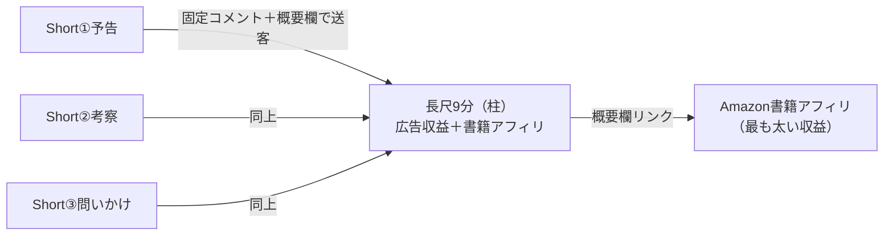

# 文学作品紹介｜制作例：太宰治『人間失格』

> このファイルは `docs/youtube-shorts-playbook.md` の適用例です。
> テーマ「文学作品紹介」で長尺9分＋連動Shorts3本の1セットを生成したデモ出力を保存しています。

---

# 📦 長尺9分＋連動Shorts3本｜1セット

## A. 長尺（約9分・解説）

**■ タイトル案**
1. 『人間失格』完全解説｜"道化"を演じ続けた男の末路
2. 太宰治『人間失格』が今の生きづらさに刺さる理由
3. なぜ私たちは『人間失格』に共感してしまうのか

**■ サムネ案**：割れた笑顔の仮面＋暗い背景、テキスト「人間失格／なぜ刺さる?」（白×黒×赤・高コントラスト・中央）

**■ イントロ台本（0:00–0:30）**
- フック（大胆な主張＋引用）：「『恥の多い生涯を送って来ました』——この一文で人生を要約できてしまう人、けっこういます」
- クリックの正当化：太宰治『人間失格』は"生きづらさ"を80年前に言語化した小説
- 賭け金：多くの人が「暗い私小説」で片づけて、本当の怖さを見落としている
- 最初のオープンループ：「最後に、なぜこの"失格"が現代でむしろ増えているのかを話します」
- 地図：「あらすじ → 3つの読み解き → 現代との接続、の順で見ます」

**■ 章立て構成（テンプレA応用・約9分・ミッドロール1本）**

| 時間 | セクション | ナレーション要点 | 画面/Bロール | テロップ | 目的 |
|---|---|---|---|---|---|
| 0:30–2:20 | あらすじ | 葉蔵が"道化"を演じ、酒・女・薬に溺れ、最後は廃人と化すまで | 暗い部屋・仮面・崩れる笑顔 | 道化→破滅 | 前提共有 |
| ≈2:20 | ピーク①(25%) | 「彼が怖かったのは"失敗"じゃない」 | 暗転 | ここから本題 | 注意リセット |
| 2:20–4:20 | 読み解き①"道化"の正体 | 人間が怖いから、先回りして笑わせる防衛本能 | 人混み・作り笑い | 笑顔=防具 | 解釈提示 |
| ≈4:20 | ピーク②(50%)＋ミッドロール | 章の切れ目で挿入 | — | — | 収益 |
| 4:20–6:20 | 読み解き②"失格"とは何か | 社会に馴染めない自分を「失格」と断じる残酷な自己定義 | 一人だけ色のない群衆 | 誰が"失格"を決める? | 深掘り |
| ≈6:20 | ピーク③(75%) | 「これ、SNSの自分と同じでは?」 | スマホの光 | 80年後の私たち | 核心 |
| 6:20–7:50 | 読み解き③現代との接続 | "いいね"用の仮面、空気を読む文化、「本当の自分が分からない」生きづらさ | 現代の街・通知 | 生きづらさの原点 | 独自考察 |
| 7:50–8:30 | まとめ | 太宰の実人生との重なり／なぜ今も読まれ続けるか。冒頭の問いに回答 | 冒頭の仮面へ回帰 | 答え合わせ | 大ループ回収 |
| 8:30–9:00 | CTA＋エンドスクリーン | 「次は太宰『走れメロス』の"裏の顔"を解説」関連2本＋登録 | エンドスクリーン | 次へ | セッション |

（テンプレA採用：あらすじ→3つの読み解き→現代接続、が文学解説で最も完走されやすい）

**■ ミッドロール配置**：4:20付近（読み解き①と②の章の切れ目＝自然な間。物語のピークは避ける）

**■ 興味のピーク**：25%「ここから本題」／50%章替わり／75%「SNSの自分と同じ」

**■ 再フック／コールバック**：冒頭の問い「なぜ"失格"が現代で増えているのか」を7:50で回収

**■ CTA＋エンドスクリーン**：「あなたも"道化"を演じてる瞬間ある? コメントで」＋関連動画2〜4本＋登録

**■ 概要欄テンプレート**
```
（冒頭3行）太宰治『人間失格』を9分で徹底解説。"道化"を演じ続けた葉蔵の物語が、
80年後のSNS時代の「生きづらさ」に直結する理由を、3つの視点で読み解きます。

0:00 イントロ
0:30 あらすじ
2:20 読み解き①道化の正体
4:20 読み解き②失格とは何か
6:20 読み解き③現代との接続
7:50 まとめ

▼今回の本（※Amazonアソシエイト・リンクを含みます＝広告）
・太宰治『人間失格』… [リンク]
※青空文庫で無料でも読めます: [リンク]

▼SNS / チャンネル登録 …
```

**■ チャプターリスト**：上記タイムスタンプ（0:00開始・6チャプター）

**■ ハッシュタグ・タグ**：#本紹介 #読書 #文学 #太宰治 #人間失格

**■ 音源/BGM**：オーディオライブラリの静かで沈鬱なピアノ（-14 LUFS・全編ナレの下）

**■ AIナレ/映像プロンプト**
- ナレ：落ち着いた低めの男声（ElevenLabs等）
- 映像：「16:9・暗い和室・割れた仮面・無表情の群衆・スマホの通知光」を15〜20秒クリップで生成しコンポジット。人物の顔は曖昧/影で（不気味の谷とグロを回避）

**■ 開示・PR設定**：合成コンテンツ開示=不要（明らかにフィクション演出）／**アフィリ開示=必須**（リンク近くに「広告/Amazonアソシエイト」明示）

**■ セルフチェック**
- [x] 16:9
- [x] -14 LUFS
- [x] チャプター0:00開始・6つ
- [x] 8分超でミッドロール
- [x] **独自考察あり（朗読丸投げでない）**
- [x] 著作権=PD原文/自作ビジュアル
- [x] アフィリ開示OK

**■ 置いた仮定**：尺=9分、制作=AI映像+TTS+図解、収益=広告+書籍アフィリ、作品=太宰治『人間失格』

---

## B. 連動Shorts（長尺から切り出す3本・各30〜40秒）

各Shortは長尺の一部を"予告/名場面"として独立させ、**末尾で長尺へ送客**します。

---

### Short① 予告フック型（35秒）

**■ タイトル案**
1. 恥の多い生涯を送って来ました
2. 80年前の小説が刺さりすぎる『人間失格』

**■ フック（0〜3秒）**
- 視覚：暗い部屋で笑顔の仮面がゆっくり割れる
- 言語：「『恥の多い生涯を送って来ました』——この一文で始まる小説、知ってる?」
- 音：低いピアノ＋ヒビ割れ音
- テロップ：「恥の多い生涯を送って来ました」

| 時間 | ナレーション | 画面 | テロップ | 効果音 |
|---|---|---|---|---|
| 0–3s | この一文で始まる小説、知ってる? | 割れる仮面 | 恥の多い生涯を… | ピシッ |
| 3–10s | 太宰治『人間失格』。人間が怖くて"道化"を演じ続けた男の手記 | 作り笑いの群衆 | 道化を演じた男 | 弦 |
| 10–22s | 酒・女・薬に溺れ、最後は"人間、失格"と自らに烙印を押す | 崩れていく影 | 失格の烙印 | 沈むBGM |
| 22–30s | でもこの"生きづらさ"、今のSNS時代にむしろ増えてる | スマホの通知光 | 80年後の私たち | ポン |
| 30–35s | なぜ刺さるのか、フル解説は長尺で | 冒頭の仮面へ回帰 | 続きは長尺で→ | — |

**■ ループ**：最後を冒頭の"割れる仮面"に回帰

**■ CTA**：「全部の解説は長尺にまとめました（概要欄/固定コメント）」＋登録

**■ 概要欄**：太宰治『人間失格』を30秒で。フル解説（9分）はこちら→[長尺リンク] #shorts #本紹介 #太宰治

**■ 縦型サムネ**：割れた仮面＋「恥の多い生涯を…」

**■ 開示**：合成=不要／著作権=PD原文・自作ビジュアル ✓

---

### Short② 名場面・考察型（38秒）

**■ フック（0〜3秒）**
- 視覚：作り笑いの自分→スマホ画面に切替
- 言語：「人に合わせて笑わせる"仮面"、あなたも被ってない?」
- テロップ：「その笑顔、防具じゃない?」

| 時間 | ナレーション | 画面 | テロップ | 効果音 |
|---|---|---|---|---|
| 0–3s | その笑顔、防具になってない? | 作り笑い→スマホ | 笑顔=防具 | ポン |
| 3–12s | 『人間失格』の葉蔵は、人間が怖いから先回りして笑わせる"道化"を演じた | 群衆の中で道化 | 怖いから笑わせる | 弦 |
| 12–26s | これ、SNSで"いいね"される自分を演じるのと、ほぼ同じ構造 | 通知とハートの嵐 | いいね用の自分 | 通知音 |
| 26–34s | 80年前に太宰は、この仮面の苦しさを書いていた | 沈む人物の影 | 80年前に予言 | 沈むBGM |
| 34–38s | "本当の自分"って何? 続きは長尺で | 冒頭の笑顔へ回帰 | 続きは長尺で→ | — |

**■ CTA**：「あなたも"道化"を演じてる瞬間ある? コメントで」＋長尺リンク

**■ ループ**：冒頭の作り笑いに回帰

**■ 概要欄**：笑顔が"防具"になってない? 太宰治が80年前に書いた仮面の苦しさ。フル解説→[長尺リンク] #shorts #人間失格 #読書

**■ 縦型サムネ**：スマホ画面に映る作り笑い＋「その笑顔、防具?」

---

### Short③ 問いかけ・共感型（35秒）

**■ フック（0〜3秒）**
- 視覚：鏡に映る自分の顔がぼやけて分からない
- 言語：「"本当の自分"が分からない——それ、80年前に書かれてた」
- テロップ：「本当の自分、分かる?」

| 時間 | ナレーション | 画面 | テロップ | 効果音 |
|---|---|---|---|---|
| 0–3s | 「本当の自分が分からない」、それ80年前に書かれてた | ぼやける鏡の顔 | 本当の自分、分かる? | キーン |
| 3–14s | 『人間失格』の核心は、社会に馴染めない自分を"失格"と断じる残酷さ | 色のない群衆に1人 | 誰が失格を決める? | 弦 |
| 14–26s | でも「馴染めない＝失格」なんて、本当は誰も決めてない | 群衆が遠ざかる | それ、本当? | 間 |
| 26–32s | 太宰はその問いを、命がけで書き残した | 原稿用紙と影 | 命がけの問い | 沈むBGM |
| 32–35s | 全部の読み解きは長尺で | 鏡へ回帰 | 続きは長尺で→ | — |

**■ CTA**：「"失格"だと感じたこと、ある? コメントで」＋長尺リンク

**■ ループ**：冒頭のぼやける鏡に回帰

**■ 概要欄**："本当の自分"が分からない感覚、太宰治が先に書いてた。フル解説→[長尺リンク] #shorts #太宰治 #人間失格

**■ 縦型サムネ**：ぼやけた鏡の顔＋「本当の自分、分かる?」

---

**3本共通スペック**
- 解像度：9:16・1080×1920
- 全編テロップあり
- 音源：オーディオライブラリ（60秒以下のトレンド音源も可）
- **独自考察を各本に付与（朗読丸投げでない）**
- 著作権：PD原文/自作ビジュアル
- PR表示：なし

---

## C. 公開・ファネル運用



**■ 公開順序**
1. **まず長尺を公開**（受け皿を先に用意）
2. 同日〜数日かけてShort①②③を時間差投稿（朝/夕/夜など）

**■ 固定コメント**：各Shortの固定コメントに「フル解説（9分）はこちら→[長尺リンク]」を設置（動画概要欄の直リンクはリーチが下がるためコメント/プロフへ誘導）

**■ 長尺概要欄**：書籍アフィリ（Amazonアソシエイト・開示必須）＋青空文庫の無料リンクを併記

**■ シリーズ展開案**（同じフォーマットで作品だけ差し替え）
- 太宰治『走れメロス』——友情の"裏の顔"
- 夏目漱石『こころ』——先生が死を選んだ本当の理由
- 芥川龍之介『羅生門』——悪を選ぶ人間の論理
- カフカ『変身』——働けなくなった人間の末路（洋文学）

---

## D. 適用メモ（次回の作業用）

| 項目 | 今回の選択 | 変更ポイント |
|---|---|---|
| テーマ | 文学作品紹介 | 固定 |
| 作品 | 太宰治『人間失格』 | 差し替え可 |
| 長尺の尺 | 9分 | 8〜15分が収益最適 |
| 長尺テンプレ | テンプレA（あらすじ→読み解き3本→現代接続） | 作品の性質で変更 |
| Shorts本数 | 3本 | 最低1本でも可 |
| Shortsタイプ | ①予告フック ②考察 ③問いかけ | Playbook §6参照 |
| 主要収益源 | 書籍アフィリ（Amazon）＞広告 | 文学カテゴリの特性 |
| 著作権 | PD（1949年没→2020年以降PD） | 新しい作品は確認必要 |
