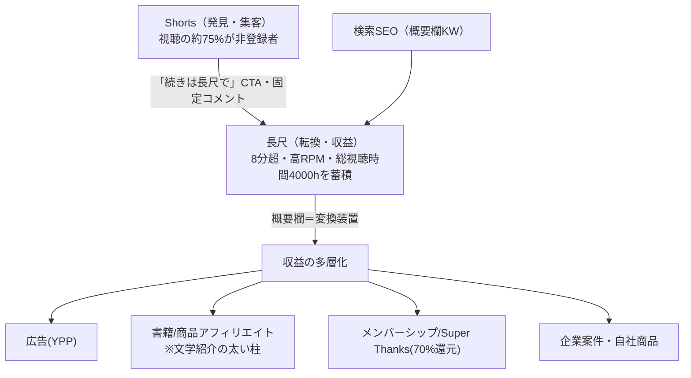
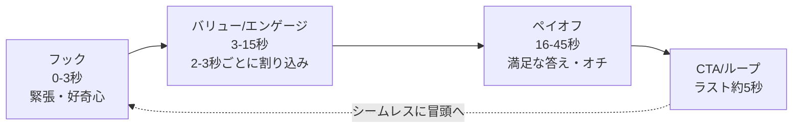
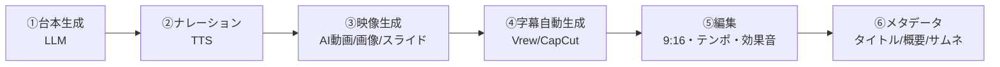

# YouTube 制作プレイブック（Shorts＋長尺・AI実行用・テーマ差し込み式）

このファイルは、**あなたがテーマを決めて記入する → AI がこのファイルを読み、そのテーマで Shorts と長尺（通常動画）の「完成台本一式」を出力する**ことを目的に設計されています。Shorts と長尺は役割が違い、**Shorts＝発見・集客／長尺＝転換・収益**の関係です（→「収益ファネル」セクション）。

- **あなた（人間）がやること** → §1 の「テーマ入力欄」を埋める（作る形式も指定）。
- **AI がやること** → §2 の指示に従い、Shorts なら §3〜§8、長尺なら §10〜§15（「長尺編」）のルールと出力フォーマットで完成台本を作る。

> 作成日: 2026-06-16 / 内容は2025〜2026年の公開情報に基づく。YouTubeのポリシー・仕様は頻繁に更新されるため、公開直前に公式ヘルプ（§10）で最新を確認してください。本書はマーケティング/制作上の解説であり、法的助言ではありません。

---

## 1. テーマ入力欄（← ここをあなたが記入）

```yaml
# 必須
THEME:            # 例）初心者向けの時短Excel術 / 文学作品紹介 など自由
作る形式:          # Shorts | 長尺 | 両方（ファネル前提なら「両方」推奨）
# 任意（未記入ならAIが推奨を自動選択）
ターゲット視聴者:    # 例）Excel初心者の社会人
ジャンル:          # 教育/ハウツー | エンタメ | 解説 | リスト/ランキング | 商品紹介 | Vlog
Shortsの尺:        # 20-30秒 | 45-60秒 | 60-90秒（短いほど完走しやすい）
長尺の尺:          # 8-10分（ミッドロール1本）| 11-15分 | 15-25分（深掘り）
トーン:            # フレンドリー | 専門的 | テンポ重視 など
CTAの目的:         # コメント誘導 | チャンネル登録 | 長尺/Shortsへ送客 | アフィリ/外部リンク
制作方法:          # AI生成（映像/音声） | 実写 | スライド/図解 | 切り抜き+解説
言語:             # 日本語（既定）
PR・タイアップ:     # なし | あり（広告主名: ___）
収益化の意図:        # 広告 | 書籍/商品アフィリエイト | メンバーシップ | 企業案件 | 自社商品
本数:             # 例）1本 | シリーズ5本ぶん | 長尺1本+Shorts3本 の連動セット
```

> 記入は THEME だけでも動きます。空欄はAIがジャンルから妥当な既定値（例：尺=20〜30秒、CTA=コメント誘導）を選びます。

---

## 2. AI への実行指示（このファイル＋上の入力を読んだら、これに従う）

あなたは動画プロデューサー兼脚本家です。§1 のテーマ入力に基づき、**指定された形式（Shorts／長尺／両方）の完成台本一式を作成**してください。Shorts は §3〜§8、長尺は §10〜§15 のルールと出力フォーマットを使います。守るべき原則：

1. **最初の2〜3秒で勝負を決める**。挨拶・ロゴ・タイトルカードは入れない（§3・§4）。
2. **完走率（平均視聴率＝APV）を最大化**する構成にする。尺は短いほど有利。指定がなければ20〜30秒を既定とする（§3・§4）。
3. **音声オフ視聴80%**を前提に、全編に焼き込みテロップを設計する（§6）。
4. **ループ設計とオープンループ**を必ず仕込む（§4）。
5. **独自の付加価値（視点・解説・検証・編集）を必ず入れる**。テンプレ量産・無加工の使い回しは禁止（§7：収益化剥奪リスク）。
6. **コンプライアンス（§7）を出力前に自己チェック**し、§8 の最後にチェック結果を付ける。PR案件なら開示を必ず含める。
7. **「作る形式」に従う**：Shorts は §8、長尺は §15 の出力フォーマットで出す。「両方」なら**まず長尺の完成台本→その長尺から切り出す Shorts（予告/名場面）を3本**作り、各 Shorts に長尺への送客CTAを入れる（→「収益ファネル」）。
8. 不明点があっても**止めずに、妥当な仮定を置いて完成させ**、仮定は出力末尾に明記する。

---

## ★ 収益ファネル（Shorts × 長尺 × 収益源）— 全体戦略

Shorts と長尺は役割が違います。**Shorts で発見・集客し、長尺で転換・収益化**します。両者は別の推薦エンジンなので、Shorts視聴者は自動では長尺に流れません＝**意図的な送客が必要**です。



**収益源の多層化（概要欄・動画内で導線設計）**

| 収益源 | 要点 |
|---|---|
| 広告(YPP) | 8分超でミッドロール複数。RPMはニッチ差大（教育/解説 CPM $10〜25、エンタメ $2〜8） |
| 書籍/商品アフィリエイト | 文学・商品紹介と相性◎。**開示必須**（§7・§4 コンプラ）。概要欄＋固定コメント |
| メンバーシップ / Super Thanks | クリエイターにネット70%還元 |
| 企業案件 | 単価は最大級。動画内の自然な紹介＋概要欄リンク |
| 自社/デジタル商品 | 講座・電子書籍など高粗利 |

> **文学作品紹介の例**：Shorts（作品の“引き”）→ 長尺（深掘り解説・考察）→ **概要欄のAmazon書籍リンク（アフィリ）**が最も太い収益になりやすい。広告だけに頼らず「その本が欲しくなる」導線を必ず設計する。

**概要欄の並び（テンプレ）**：①動画要約＋キーワード（冒頭3行）→ ②章タイムスタンプ → ③最重要リンク（書籍/商品・**開示付き**）→ ④SNS/登録。固定コメントに登録CTA＋最重要リンク。

---

# Shorts編（発見・集客）

## 3. アルゴリズムの大原則（なぜこう作るか）

| 原則 | 内容 | 信頼度 |
|---|---|---|
| 配信は Explore & Exploit | 登録者数と無関係に、まず小さなテスト集団へ配信→反応が良ければ拡大。反応が弱いと露出が枯れる | 中〜高 |
| 4大シグナル | ①スワイプ離脱率（低いほど良）②視聴維持/完走率 ③エンゲージ（特に**シェア**）④ループ/再視聴率 | 中 |
| 最初の3秒 | 離脱の50〜60%は最初の3秒で発生。**冒頭にオチ・価値を出す（lead with the payoff）** | 中 |
| 指標は尺でなくAPV | YouTubeは尺でなく平均視聴率を重視。「40%×3分」は「90%×45秒」に負ける | 高 |
| 再生カウント変更(2025/3/31) | 再生開始ごとに1ビュー化。ただし**収益・YPPは"engaged views"基準**で別計算。総再生数に惑わされない | 高 |
| 鮮度優先化("The Flattening", 2025末) | 投稿後約28〜30日で古い動画の再生が落ちる傾向（未確定）。**継続的な新規投稿が重要** | 中・未確定 |
| 反復・量産は収益化外(2025/7/15) | テンプレ流用・低品質AI量産・無加工使い回しは「inauthentic content」で収益化除外 | 高 |
| 透かし転載はリーチ抑制 | TikTok等のロゴ/透かし付き転載は推薦されにくい | 中 |

**伸ばす運用の目安**：投稿は週2〜4本〜1日2〜3本（ニッチで調整、ただし**フック最優先・投稿時間は二次的**）。タイトルは冒頭にキーワード＋4〜6語。ハッシュタグは3〜5個（60個超で無効化）。Shortsは発見装置（視聴の約3/4が非登録者）、長尺は収益/視聴時間——という**ファネル設計**で長尺へ送客する。

**リテンションのベンチマーク（公式値ではなく分析メディアの観測値＝方向性の目安）**

| 指標 | 健全な目安 |
|---|---|
| 平均視聴率(APV) | 70%以上（30秒未満は90%超、60秒前後は75〜85%） |
| イントロ維持率（3秒通過） | 70%以上（下回るならフック作り直し） |
| Viewed率（視聴/スワイプ離脱） | 70%超でバイラルの引き金、60%未満は不振 |
| スワイプ離脱率 | 30%以下が健全（40%超で推薦が止まる目安） |

---

## 4. 構成・脚本の設計ルール

### 4.1 フック（0〜3秒）は3種を重ねる
- **視覚フック**：開始1〜2秒の「動き」が最強（急ズーム、ポーズ急変、注ぐ/割る/落とす等のパターンブレイク）。
- **言語フック**：最初の一言を3秒以内に着地。鉄板3型 → **逆説型**（「みんな〇〇と言うけど実は逆」）／**失敗警告型**（「あなたは〇〇を間違ってる」）／**リスト予告型**（「〇〇トップ5、最後が衝撃」）。
- **音フック**：効果音・ビート。視覚＋言語＋音を1.5秒以内に重ねると視聴時間が大きく伸びる。
- **NG**：挨拶（「どうも〜」）・ロゴ・イントロ・スローな立ち上がり。

### 4.2 リテンションを保つ4層構造



- **2〜3秒ごとにパターン割り込み**（カット・ズーム・テロップ・効果音）で注意をリセット。
- **最大の離脱要因は「弱いオチ（ペイオフ不足）」**。前振りだけで終わらせない。

### 4.3 使えるフレームワーク（60秒換算の配分）
- **PAS**：問題提起0-10s / 煽り10-20s / 解決20-40s / 限定性40-50s / 行動喚起50-60s
- **BAB**：Before（痛み）→ After（理想）→ Bridge（手段）。寒色→暖色で感情を演出
- **ABT**：And（文脈）→ But（対立）→ Therefore（結論）。瞬間説得に最適
- **三幕**：設定→対立→解決（完走率が上がりやすい）

### 4.4 ループとオープンループ
- **ループ設計**：最後を冒頭フレーム/冒頭の一言にシームレスに繋ぐ（再ループは追加再生としてカウントされ好シグナル）。
- **オープンループ**：冒頭で「後半に〇〇を出す」と予告／謎を提示／クリフハンガーで“最後まで”を約束。

### 4.5 尺・テロップ・CTA
- **尺**：20〜25秒が完走率トップ。情報量が必要なら30〜60秒、物語/深掘りは90秒〜3分（その分、冒頭で「最後まで見る理由」を約束）。
- **テロップ**：焼き込み必須。大きく・高コントラスト・単語/句単位、表示1.5〜3秒、音声より0.1〜0.3秒先出し。**画面下20%・右側アイコン帯を避ける**（§6 安全領域）。
- **CTA**：自然なオチ（満足ピーク）の直後に短く。コメントは「賛否の出る結論」「あなたはどっち?」で誘発。登録はオープンループ回収直後に。

---

## 5. 構成テンプレート集（秒数つき・AIはジャンル/尺で選ぶ）

### A. 30秒 高速リスト型（教育/ハウツー・量産向き）
- 0–2s 逆説フック「〇〇、9割が間違ってます」（急ズーム＋効果音）
- 2–5s 「3つだけ」と予告（#1を軽く先出し＝オープンループ）
- 5–15s ③→②を各2〜3秒、番号テロップ
- 15–25s ①を理由＋ミニ実例
- 25–28s まとめ一言
- 28–30s CTA「①できてた人はコメントで✋」＋冒頭テロップへ視覚回帰（ループ）

### B. 60秒 PAS型（解説/商品紹介）
- 0–5s 問題提起＋呼びかけ「〇〇で悩んでない?」
- 5–15s 結論を先出し
- 15–30s 共感・煽り（放置するとどうなるか）
- 30–50s 解決策/商品を「答え」として自然提示＋具体例
- 50–55s 限定性・実績
- 55–60s 行動喚起＋未解決の二次疑問でループ

### C. 45秒 三幕ストーリー型（Vlog/エンタメ）
- 0–3s 結末チラ見せ（コールド・オープン）
- 3–8s 設定（誰が・何を）
- 8–25s 対立・障害（2〜3秒ごとにカット）
- 25–40s 解決・どんでん返し（ペイオフ）
- 40–45s 冒頭シーンに着地＝ループ＋「次どっち見たい?」

### D. 25秒 ビフォーアフター型（商品/美容/DIY）
- 0–2s Afterを一瞬「これ、元はこう」
- 2–5s Beforeの痛み（寒色・暗め）
- 5–18s 工程の小出し（「何になると思う?」＝ドリップ）
- 18–23s After完成（暖色・明るく）
- 23–25s CTA＋冒頭Afterに回帰（ループ）

### E. 30秒 カウントダウン型（リスト/ランキング/エンタメ）
- 0–3s 「〇〇トップ5、1位がヤバい」（1位を予告）
- 3–6s 5位（速いテンポ＋番号テロップ）
- 6–18s 4→3→2位を各3〜4秒
- 18–27s 1位を尺多め・賛否の出る結論
- 27–30s 「あなたの1位は?」コメント誘導

### F. 60秒 How-to（教育/チュートリアル）
- 0–3s ベネフィット宣言「3分で〇〇できる方法」
- 3–10s 完成形チラ見せ（オープンループ）
- 10–45s 手順①②③、各ステップに番号テロップ＋2〜3秒カット
- 45–55s よくある失敗を1つ（差別化）
- 55–60s 完成＋「保存して試してね」

### G. 20秒 パターン割り込み連打型（最高完走率狙い・エンタメ）
- 0–1s 動きフック（割る/落とす）
- 1–3s 言語＋音フックを重ねる
- 3–15s 2秒ごとに視覚転換、情報を一気に
- 15–18s オチ
- 18–20s 冒頭フレーム回帰でシームレスループ

### H. 90秒〜3分 物語・深掘り解説型（解説/ドキュメンタリー風）
- 0–5s 強フック＋結論or衝撃を先出し
- 5–15s 文脈（ABTのAnd）
- 15–60s 対立・展開、30〜45秒ごとに割り込み＆中盤ティーズ
- 60–150s 核心の解説（But→Therefore）
- ラスト10–15s まとめ＋未解決の問いでコメント誘導

---

## 6. 制作・編集仕様（AI動画生成を含む）

### 6.1 技術仕様
| 項目 | 推奨 |
|---|---|
| アスペクト比 | **9:16 縦型**（16:9だとShorts棚に乗らない） |
| 解像度 | **1080×1920px**（入稿は最大4K縦も可、配信は最大1080p） |
| フレームレート | 30fps（滑らかさ重視なら60fps） |
| 尺 | 最大3分（180秒）。**トレンド音源の自動ライセンスは60秒以下のShorts限定** |

### 6.2 安全領域（UIに隠れない配置）
- 重要テロップ・CTA・焦点は**中央 約900×1160px（さらに保守的には中央4:5）以内**。
- 空けるマージン：**下 300〜400px**（チャンネル名・説明・音源バー）、**右 約96px**（いいね/コメント/共有）、**上 約120px**（ノッチ）、**左 約60px**。常に「説明展開状態」を想定して下端を空ける。

### 6.3 編集
- 冒頭6秒で離脱判断 → 1カット目に強フック。**2〜4秒に1カット**＋2〜3秒ごとのパターン割り込み。無音・「えー」を間引く。
- テロップ：大・高コントラスト・縁取り、単語/句単位のキネティックタイポ、表示1.5〜3秒。
- 音量：会話 -12〜-6dB、BGMはナレーションを邪魔しない。色は明るめ・高コントラストで統一。

### 6.4 音源（著作権）
- **安全**：YouTubeオーディオライブラリ（無料・Content IDなし）／YouTube Creator Music／ロイヤリティフリー系（Epidemic Sound等）。
- **危険**：市販曲・Spotify音源をそのまま使用。トレンド音源は60秒以下Shorts限定・使い回し非推奨。
- **重要**：1分超のShortsにContent IDクレームが付くとブロックされる。
- **ナレーションTTS**：ElevenLabs（表現力・多言語）／VOICEVOX（無料・日本語特化）／Google・Azure・OpenAI TTS（安定朗読）。

### 6.5 AIで動画を作るワークフロー



- **映像ツールのカテゴリ（世代変化が速い＝要確認）**：Google Veo（音声ネイティブ生成）、OpenAI Sora、Runway、Kling（参照画像＋Lip Sync）、Pika/Luma/Hailuo、スライド型（Canva AI 等）。
- **品質を上げるコツ**：プロンプトに「シーン記述（人物・背景・時間帯・雰囲気）＋動き（カメラ移動・速度）＋技術要素（9:16・解像度・秒数・fps）」を明記。**参照画像でキャラ/トーンを固定**、**シーン分割で短クリップ化**、ネガティブプロンプトで破綻抑制。手/指/顔/ちらつき/持ち物すり替わり/リップシンクを検品。

### 6.6 制作仕様チェックリスト（AIが出力時に満たす）
- [ ] 9:16 / 1080×1920 / 30fps、尺は目的に合致（トレンド音源使用なら≦60秒）
- [ ] 重要素は中央60%（理想4:5）内、下300〜400px・右96pxを空ける
- [ ] 冒頭6秒に強フック（イントロ/ロゴなし）
- [ ] 全編に焼き込みテロップ（大・高コントラスト・1.5〜3秒）
- [ ] 2〜4秒に1カット＋2〜3秒ごとの割り込み
- [ ] 音源は合法（オーディオライブラリ/Creator Music/RF/ライセンス済）
- [ ] 人間の付加価値（独自視点・解説・検証）を付与（量産・反復回避）

---

## 7. コンプライアンス（公開前チェック・必読）

> 一般的解説であり法的助言ではありません。出典は §10。ポリシーは更新されるため公開直前に公式ヘルプで再確認を。

### 7.1 収益化(YPP)の前提（参考）
- **Tier1（早期アクセス）**：登録500人＋90日に公開3本＋（90日でShorts視聴300万回 or 12か月で3,000時間）。
- **Tier2（広告収益）**：登録1,000人＋（90日でShorts視聴**1,000万回** or 12か月で**4,000時間**）。**長尺時間とShorts回数は合算不可**。
- Shorts収益は「クリエイタープール方式」で、音楽ライセンス控除後の割り当ての**45%**をクリエイターが受領。

### 7.2 公開前チェックリスト
**A. 原本性・収益化**
- [ ] 自分のオリジナルか（他人クリップの寄せ集め・再アップでない＝reused content回避）
- [ ] テンプレ量産・反復・低品質AI量産でないか（**inauthentic content＝収益化除外・チャンネル全体に波及**）
- [ ] 自動音声/AIだけで人間の文脈・洞察が欠けていないか（AI利用自体はOK、付加価値なき量産がNG）

**B. AI・合成コンテンツ開示**
- [ ] **リアルに見えるAI/合成の映像・音声**を含むなら、Studioで「Altered or synthetic content」を設定（実在人物の合成音声・実在の出来事の改変は開示必須）

**C. 音楽・著作権**
- [ ] 楽曲はオーディオライブラリ/許諾済みか、Content IDクレームの可能性を確認
- [ ] 1分超Shortsにクレームが付くとブロックされる点を理解

**D. コミュニティガイドライン**
- [ ] 危険行為/チャレンジ・有害な誤情報・スパム/欺瞞・規制対象品を含まない

**E. 広告・ステマ（日本）**
- [ ] 企業から報酬/商品提供を受けた場合、**明瞭なPR表記**（#PR・冒頭表示・音声等を、概要欄だけでなく見落とされにくい場所に）
- [ ] YouTubeの「**有料プロモーションを含む**」設定を有効化（景表法対応とは別に併用）

**F. 子ども向け（COPPA）**
- [ ] 「**子ども向け（Made for Kids）**」を正しく設定（子ども向けはパーソナライズ広告・コメント・投げ銭が無効化＝収益減）

**G. アカウント前提**
- [ ] 2段階認証が有効、コミュニティガイドラインのストライクなし

### 7.3 長尺・AI量産で特に重要（2026年の強化）
- **2025/7のinauthenticポリシー → 2026/1に大量チャンネル削除**（収益化停止でなく**チャンネルごと削除**の事例多数）。**AIが台本・音声・映像・公開を全部やり、人間の編集判断がゼロ**のテンプレ反復・量産が標的。
- **生存条件＝認識できるペルソナ・独自の視点/構成/考察・編集の付加価値**。AIは研究・構成補助・音声・字幕には使ってよいが、**朗読の丸投げはNG**。
- **AI開示ラベルは収益化可否とは別軸**。「リアルな合成音声/映像」を含むなら開示するが、開示しても独自性が無ければ収益化されない。
- **アフィリエイト開示**：商品/書籍リンクには「広告/PR」を明示（日本＝景表法ステマ規制、米Amazon＝規約上の開示義務。例：「Amazonアソシエイトとして適格販売により収入を得ています」）。

---

## 8. 出力フォーマット（AI はこの形で完成台本を出す）

> §1 のテーマで、以下の全項目を埋めて出力する。秒数はテーマの尺に合わせて調整する。

```
■ タイトル案（3つ／冒頭にキーワード・4〜6語・好奇心/緊張）
  1) …
  2) …
  3) …

■ フック（0〜3秒）
  - 視覚: （動き／画面）
  - 言語: （最初の一言・鉄板型のどれか）
  - 音:   （効果音/ビート）
  - テロップ: （7語以内・大）

■ 本編スクリプト（秒数つき・表）
  | 時間 | ナレーション/セリフ | 画面・映像（AI生成プロンプト可） | テロップ | 効果音/BGM |
  |------|--------------------|------------------------------|---------|-----------|
  | 0-3s | … | … | … | … |
  | …    | … | … | … | … |
  （採用した構成テンプレ名と理由を1行で明記）

■ オープンループ＆ループ設計
  - 冒頭の予告/謎: …
  - 最後→冒頭の接続: …

■ CTA（満足ピーク直後・短く）
  - 文言: …（コメント誘導は賛否の出る問い）

■ 概要欄（最初の125字にキーワード）
  …

■ ハッシュタグ
  #shorts ＋ 関連3〜5個

■ 縦型サムネ案
  - 画像の方向性: …
  - 文字（7語以内・高コントラスト・安全領域内）: …

■ 音源の指針
  - 推奨（合法）: …（60秒超なら特に注意）

■ AI映像生成プロンプト（シーンごと・任意）
  - シーン1: 「シーン記述＋動き＋カメラ＋9:16/解像度/秒数」
  - …（参照画像/ネガティブプロンプトの指示）

■ 開示・PR設定（必要時）
  - 合成コンテンツ開示: 要/不要（理由）
  - PR表記: …（あれば文言と表示位置）

■ セルフチェック（§6.6・§7.2を満たすか／満たさない項目と対処）
  - …

■ 置いた仮定（入力が空欄だった項目の既定値）
  - …
```

---

## 9. 記入例（サンプルテーマでの通しデモ）

> これは**フォーマットの見本**です。実際の THEME はあなたが §1 で決めます。
> 例テーマ：`初心者向けの時短Excel術` / ジャンル：教育・ハウツー / 尺：30秒 / CTA：コメント誘導 / 制作：スライド+解説

```
■ タイトル案
  1) Excel初心者が9割やる時短ミス
  2) 知らないと損するExcel時短3選
  3) Excel、まだマウスで消してるの?

■ フック（0〜3秒）
  - 視覚: セルを手作業で消す→急ズームでショートカット連打に切替
  - 言語: 「Excel、9割が遅いやり方してます」（逆説/失敗警告型）
  - 音:   タイプ音＋“ポン”
  - テロップ: 「9割が損してるExcel時短」

■ 本編スクリプト
  | 時間  | ナレーション | 画面 | テロップ | 効果音 |
  |-------|-------------|------|---------|--------|
  | 0-3s  | Excel、9割が遅いやり方してます | 手作業→ショートカット | 9割が損してる時短 | ポン |
  | 3-6s  | 3つだけ。最後が一番効きます | 番号3つを提示 | ①②③ 最後が神 | スワイプ |
  | 6-14s | ③ Ctrl+方向キーで一気に移動 | 操作画面 | ③一瞬で端まで | カチ |
  | 14-22s| ② Ctrl+Shiftで範囲を瞬間選択 | 操作画面 | ②選択が秒 | カチ |
  | 22-28s| ① Alt+=で合計を自動入力 | 操作画面 | ①合計0.5秒 | ピコン |
  | 28-30s| できてた人いる? コメントで | 冒頭の画面に回帰 | できてた?→💬 | ポン |
  （テンプレA・高速リスト型を採用：時短ネタはリスト×番号テロップが完走率高）

■ オープンループ＆ループ: 冒頭で「最後が一番効く」と予告／最後は冒頭の“遅いやり方”画面に回帰
■ CTA: 「①②③、できてたのどれ? コメントで教えて」
■ 概要欄: Excel初心者がやりがちな遅い操作を、3つのショートカットで一気に時短。最後のAlt+=は特におすすめ…
■ ハッシュタグ: #shorts #Excel #エクセル #時短 #仕事効率化
■ 縦型サムネ案: 操作画面＋「Excel時短3選」（黄×黒・中央配置）
■ 音源: YouTubeオーディオライブラリのアップテンポBGM（30秒・合法）
■ 開示・PR設定: 合成コンテンツ開示=不要（実画面録画）／PR=なし
■ セルフチェック: 9:16・テロップ全編・2〜3秒カット・反復量産でない・著作権OK ✓
■ 置いた仮定: 尺=30秒、制作=画面録画+TTS を既定採用
```

---

# 長尺編（転換・収益の柱）

## 10. 長尺アルゴリズムの大原則

| 原則 | 内容 | 信頼度 |
|---|---|---|
| 推薦は「マッチング予測」 | 押し出しでなく、視聴者ごとに「次に長く満足して見るもの」を予測して引き寄せる | 高/中 |
| サーフェスごとに別エンジン | ブラウズ/関連/検索/通知は別システム。**Shorts推薦は長尺と分離**（Shorts視聴者は自動では長尺に来ない） | 中 |
| 主要シグナル | **CTR ×（AVD/APV）× 満足度**の掛け算 | 高 |
| 満足度で重み付けされた視聴時間 | 生の視聴分数を、満足度サーベイ・リピート・セッション継続で重み付け（2025の最重要転換） | 高/中 |
| セッション視聴時間 | 「自分の動画の後もYouTubeに残るか」。長尺推薦の中核。エンドスクリーン/プレイリストで複利化 | 中 |
| 初速48時間 | 数分でテスト配信→好成績なら24〜48hで拡大→7〜14日で本格化。離陸しないと伸びにくい | 中 |
| クリックベイトは逆効果 | 高CTR×低AVD＝クリックベイト判定で失速。約束（サムネ/タイトル）と中身を一致させる | 高 |

**ベンチマーク（公式値か分析値かを明記）**
- CTR：**公式レンジ 2〜10%**（半数がこの帯）。平均4〜6%、5〜8%で平均以上、10%超で優秀（後者は分析値）。
- 維持率：全体平均 約23.7%、50%超は約6本に1本、堅実50〜60%、優先推薦の目安70%前後（**いずれも分析値**）。
- 冒頭：**最初の60秒で約55%が離脱**、判断は約8秒。公式は最初の30秒を"Intro"区分。

**避けるべき**：クリックベイト、弱い/遅いフック、無計画なニッチジャンプ、外部流入オンリー、Sub4Sub・購入視聴（規約違反）、単調な間延び。

---

## 11. 長尺の構成・脚本ルール

### 11.1 イントロ（最初の15〜30秒）＝最大の勝負所
- 冒頭60秒で約55%が離脱。挨拶・ロゴは3〜5秒以内、すぐ本題へ。明確な価値提案で平均視聴時間が大きく伸びる。
- **20秒以内に3つを同時成立**：①クリックの正当化（サムネ/タイトルの約束を即裏付け）②賭け金を上げる（見逃すと何を失うか）③**最初のオープンループを開く**（答えを保留した疑問）。
- フック3型：**大胆な主張／質問／結果先出し（payoff preview）**。
- **動画の地図（promise/preview）**を提示して「この長さを見る価値」を明示。

### 11.2 本編：オープンループ連鎖＋章立て
- 各章で小ループを開閉し、**章をまたぐ大ループ**を冒頭で張りラストで回収（コールバック）。
- 章立て（導入・要点・まとめ）は維持率・SEO・視聴時間を改善。説明欄のチャプターは「心の地図」。
- フレームワーク：問題→解決／リスト型（番号＝進捗バー）／ストーリーテリング／「説明→実例→代替案」の3拍子。
- **パターン割り込みを30〜90秒ごと**（最初は25〜35秒地点）。**興味のピークを25%/50%/75%地点**に（クリフハンガー・印象的瞬間・核心インサイト）。
- **Bロールは“休息”にしない**（必ずテロップ/ナレで情報密度を保つ）。フィラーは全カット。

### 11.3 尺・終了設計
- **8分以上でミッドロール解禁**（収益の分岐点）。解説/教育は5〜10分（単一概念）〜15〜25分（深掘り）。**長さより視聴維持が収益ドライバー**（水増しは逆効果）。
- 終了：カードは50〜75%地点、エンドスクリーンは4〜20秒で関連動画2〜4本＋登録、**同トピッククラスター/プレイリストへ誘導**してセッションを伸ばす。

---

## 12. 長尺 章立てテンプレート（タイムスタンプつき）

### テンプレA：問題→解決型（約9分・ミッドロール1本）
| 時間 | セクション | 目的・演出 |
|---|---|---|
| 0:00–0:20 | フック | 大胆な主張/質問＋結果チラ見せ。最初のオープンループ。挨拶なし |
| 0:20–0:45 | 約束＋予告 | 「見終わると◯◯できる」＋章の地図。25〜35秒でパターン割り込み |
| 0:45–2:30 | 第1章 問題の核心 | なぜ起きるか＋実例（Bロールにテロップ/VO） |
| ≈2:30 | ピーク①(25%) | クリフハンガー/意外な事実 |
| 2:30–4:30 | 第2章 解決策 | 全体像→具体ステップ（番号進行・図解多用） |
| ≈4:30 | ピーク②(50%)＋ミッドロール | 物語ピーク直後に手動配置。CTAカードも50〜75%帯 |
| 4:30–6:30 | 第3章 実践・実例 | コールバックで第1章を回収 |
| ≈6:30 | ピーク③(75%) | 最も意外/価値あるインサイト |
| 6:30–8:00 | 第4章 落とし穴＋応用 | 冒頭の大ループを完全回収 |
| 8:00–8:40 | まとめ | 要点再提示＋「今日からできる1つ」 |
| 8:40–9:00 | CTA＋エンドスクリーン | 次動画へ（今を参照→新しい好奇心→次の変化を約束）＋関連2〜4本 |

### テンプレB：リスト型（◯個の○○）ストーリー解説（約11分・ミッドロール1本）
| 時間 | セクション | 目的 |
|---|---|---|
| 0:00–0:15 | コールドオープン | 結果先出し/大胆な主張 |
| 0:15–0:50 | 賭け金＋大ループ | 「最後が一番ヤバい」＋全項目を予告 |
| 0:50–2:50 | 項目① | 説明→実例→代替案の3拍子・番号字幕 |
| ≈2:50 | ピーク①(25%) | 印象的な実例 |
| 2:50–4:50 | 項目② | 前項目へコールバック |
| ≈5:00 | ピーク②(50%)＋ミッドロール | 項目間の切れ目に手動配置 |
| 5:00–7:00 | 項目③ | テンポを上げる |
| ≈7:30 | ピーク③(75%) | 最重要項目を温存 |
| 7:30–9:30 | 項目④（核心） | 冒頭の大ループ回収 |
| 9:30–10:20 | まとめ | 全項目を1枚に・冒頭ストーリーへ着地 |
| 10:20–11:00 | CTA＋エンドスクリーン | クラスター内の次動画へ |

> 説明欄のチャプターマーカー（0:00開始・3つ以上・各10秒以上）を必ず設定する。

---

## 13. 長尺 パッケージング（サムネ・タイトルでCTR）

**サムネ（チェックリスト）**
- [ ] 顔/感情を主役、視覚要素は2〜3個まで
- [ ] テキスト3〜4語・太字サンセリフ・核は1〜3語
- [ ] 2〜3色の高コントラスト（主役を背景比±30%明暗）
- [ ] **モバイルのアイコンサイズで判読可**・1280×720・高画質
- [ ] サムネとタイトルの「約束」が一致（誇張・誤誘導はNG＝中期で推薦激減）
- [ ] **Test & Compareで最大3案A/B**（勝敗は**総視聴時間シェア**＝CTRではない・最大14日・PC Studio）

**タイトル（チェックリスト）**
- [ ] キーワードを先頭5語以内に前置き
- [ ] モバイル35〜40字で切れる前提、核を前へ（全体50〜70字）
- [ ] 好奇心ギャップ（問い/感情語/算用数字）
- [ ] パワーワードは1〜2語まで、クリックベイトにしない（保持率優先）

---

## 14. 長尺 制作・編集仕様（16:9・LUFS・章・AI）

**技術**
- 16:9・1080p以上（**4K書き出しが有利**）／元素材とfps一致（解説は24 or 30）／H.264 High・MP4・2-pass VBR／音声 AAC-LC 48kHz。
- **ラウドネス -14 LUFS**（ナレーションは -14〜-16、**小さい音は持ち上げられない**ので-14付近で仕上げる）、トゥルーピーク -1 dBTP。
- 説明欄チャプター（**0:00開始・3つ以上・各10秒以上**）、字幕SRT/VTT（UTF-8・人手校正）。

**編集（中だるみ対策）**
- 1カット15〜25秒を基調に、**2〜3分ごとにバーストシーケンス**（速いカット連打）。**15〜90秒ごとにパターン割り込み**。章の切り替えに明確な区切り（タイトルカード/間/音）。図解・テロップで補強。

**AIで作るワークフロー（分業が前提）**

- **AI動画は1クリップ15〜20秒が上限**→従来エディタ（DaVinci/CapCut/Premiere）でコンポジット。LLMは**構成・アウトライン補助**に使い、**考察・編集判断・配置は人間**が行う。

**制作仕様チェックリスト**
- [ ] 16:9・1080p以上（4K書き出し）・fps一致・2-pass VBR・AAC48kHz
- [ ] -14 LUFS（ナレ-14〜-16）・TP -1dBTP
- [ ] チャプター0:00開始3つ以上・字幕SRT/VTT人手校正
- [ ] 15〜90秒ごと割り込み＋2〜3分ごとテンポの波・8分超の中だるみを点検
- [ ] **人間の付加価値（独自の構成・考察・編集）を付与**（AIナレ朗読の丸投げはNG＝§7.3）
- [ ] ミッドロールを自然な切れ目に手動＋自動（8〜10分で1〜2本・ブレイク間2分）

---

## 15. 長尺 出力フォーマット（AI はこの形で完成台本を出す）

```
■ タイトル案（3つ／キーワード前置き・好奇心）
■ サムネ案（顔/感情＋テキスト3〜4語・高コントラスト）
■ イントロ台本（0:00–0:30）
   - フック（大胆な主張/質問/結果先出し）
   - クリックの正当化／賭け金／最初のオープンループ
   - 動画の地図（この動画で何が手に入るか）
■ 章立て構成（タイムスタンプ表）
   | 時間 | セクション | ナレーション要点 | 画面/Bロール（AI生成プロンプト可） | テロップ/図解 | 目的 |
   （採用テンプレ名と理由・各章の小ループ）
■ ミッドロール配置（分:秒・なぜそこか＝自然な切れ目）
■ 興味のピーク（25%/50%/75%地点に何を置くか）
■ 再フック／コールバック（冒頭の大ループをどこで回収するか）
■ CTA＋エンドスクリーン（次動画/プレイリストへ・新しい好奇心で締め）
■ 概要欄（冒頭3行にKW→章タイムスタンプ→最重要リンク→アフィリ(開示付)→SNS/登録）
■ チャプターリスト（0:00 …／3つ以上）
■ ハッシュタグ・タグ
■ 音源/BGM指針（-14 LUFS・合法な音源）
■ AIナレ/映像生成プロンプト（章ごと・15〜20秒クリップ前提）
■ 開示・PR設定（合成コンテンツ開示／アフィリ開示文言）
■ セルフチェック（§14・§7.2・§7.3）
■ 置いた仮定
```

---

## 16. 長尺 記入例（文学・カフカ『変身』約9分解説）

> 先の Shorts（38秒）の“続き”として作る長尺。Shorts で興味 → 長尺で深掘り → 概要欄の書籍リンクで収益、という連動例。

```
■ タイトル案
  1) 『変身』完全解説｜虫になった男が映す現代
  2) カフカ『変身』が100年後の私たちに刺さる理由
  3) なぜ家族は彼を見捨てたのか｜『変身』を読み解く

■ サムネ案: 虫の影＋暗い寝室、テキスト「変身／なぜ見捨てた?」（赤×黒・高コントラスト）

■ イントロ台本（0:00–0:30）
  - フック（質問）「もし家族が“虫”になったら、あなたは最後まで支えられますか?」
  - 正当化: カフカ『変身』はその問いを100年前に突きつけた小説
  - 賭け金: 多くの人が“あらすじ”で止まり、本当に怖い核心を見落としている
  - オープンループ: 「最後に、なぜ家族が“解放された”のかを話します」
  - 地図: 「あらすじ→3つの読み解き→現代との接続、の順で見ます」

■ 章立て構成（テンプレA：問題→解決型・約9分）
  | 時間 | セクション | ナレ要点 | 画面/Bロール | テロップ | 目的 |
  | 0:30–2:00 | あらすじ | グレゴールが虫に／最初の心配は“遅刻” | 寝室・時計の影 | 心配は“仕事” | 前提共有 |
  | ≈2:00 | ピーク①(25%) | 「ここからが本当に怖い」 | 暗転 | ここから本題 | 注意リセット |
  | 2:00–4:00 | 読み解き①“役立たなさ” | 働けない＝価値を失う構図 | 食卓から遠ざかる家族 | 価値=労働? | 解釈提示 |
  | ≈4:00 | ピーク②(50%)＋ミッドロール | 章の切れ目で挿入 | — | — | 収益 |
  | 4:00–6:00 | 読み解き②“家族の変化” | 心配→疎み→厄介者 | ドアが閉まる | 愛は条件付き? | 深掘り |
  | ≈6:00 | ピーク③(75%) | 「妹の最後の一言」 | 窓の光 | 衝撃の結末 | 核心 |
  | 6:00–7:40 | 読み解き③現代との接続 | 介護・過労・自己疎外に重なる | 現代の街/影 | 100年後の私たち | 独自考察 |
  | 7:40–8:30 | まとめ | 冒頭の問いに回答（“解放”の意味） | 冒頭寝室へ回帰 | 答え合わせ | 大ループ回収 |
  | 8:30–9:00 | CTA＋エンドスクリーン | 「次は『城』を解説」関連2本＋登録 | エンドスクリーン | 次へ | セッション |
  （テンプレA採用：問題提起→3つの読み解き→現代接続が解説の王道）

■ ミッドロール配置: 4:00付近（読み解き①と②の章の切れ目＝自然な間）
■ 興味のピーク: 25%「ここから本番」／50%章替わり／75%「妹の最後の一言」
■ コールバック: 冒頭の問い「最後まで支えられるか」を8:00で回収
■ CTA＋エンドスクリーン: 「あなたはグレゴールを見捨てない自信ある? コメントで」＋関連動画2〜4本＋登録
■ 概要欄:
   （冒頭3行）カフカ『変身』を9分で徹底解説。虫に変わった男と家族の物語が、100年後の「働けなくなった人の疎外」を突く理由を3つの視点で読み解きます。
   0:00 イントロ / 0:30 あらすじ / 2:00 読み解き①役立たなさ / 4:00 読み解き②家族 / 6:00 読み解き③現代 / 7:40 まとめ
   ▼今回の本（※Amazonアソシエイト・リンクを含みます＝広告）
   ・カフカ『変身』… [リンク]
   ▼SNS / チャンネル登録 …
■ チャプターリスト: 上記タイムスタンプ（0:00開始・6つ）
■ ハッシュタグ・タグ: #本紹介 #読書 #文学 #カフカ #変身
■ 音源/BGM: オーディオライブラリの静かで不穏なBGM（-14 LUFS・全編ナレの下に敷く）
■ AIナレ/映像プロンプト: ナレ=ElevenLabs等の落ち着いた朗読／映像=「16:9・寝室・虫の影・食卓・窓の光」を15〜20秒クリップで生成しコンポジット。リアルな虫グロは避け影で表現。
■ 開示・PR設定: 合成コンテンツ開示=不要（明らかにフィクション演出）／**アフィリ開示=必須**（概要欄リンク近くに「広告/Amazonアソシエイト」明示）
■ セルフチェック: 16:9・-14 LUFS・章0:00開始6つ・8分超でミッドロール・**独自考察あり（朗読丸投げでない）**・著作権=PD原文/自作ビジュアル・アフィリ開示OK ✓
■ 置いた仮定: 尺=9分、制作=AI映像+TTS+図解、収益=広告+書籍アフィリ、作品=カフカ『変身』
```

> **著作権の再注意（文学長尺）**: 引用はパブリックドメイン原文（青空文庫等）か自作要約で。**翻訳には別途著作権**が残ることがある（PDライセンスの訳を選ぶ）。書影は権利確認。長い朗読の全文化は避け、要約＋短い引用＋独自考察に留める。

---

## 17. 出典・信頼度の注記

- **信頼度【高】（YouTube公式/Google公式）**：再生カウント変更(2025/3/31)、inauthentic content ポリシー(2025/7/15)、YPP参加条件、Shorts収益45%分配、AI/合成コンテンツ開示義務、Content IDの1分超ブロック、Made for Kids。
- **信頼度【中】（複数の専門メディア一致）**：4大シグナル、フック/構成の型、尺別の完走率、リテンション・ベンチマーク、安全領域のピクセル値、AIツールの世代。
- **【中・未確定】**："The Flattening"（鮮度優先化）はクリエイター報告ベースで公式未確認。

**主な公式ソース**
- YouTube Help: パートナープログラム参加資格 https://support.google.com/youtube/answer/72851
- YouTube Help: Shorts 収益化ポリシー https://support.google.com/youtube/answer/12504220
- YouTube Help: チャンネル収益化ポリシー（inauthentic/reused） https://support.google.com/youtube/answer/1311392
- Google Blog: AI/合成コンテンツの開示 https://blog.youtube/news-and-events/disclosing-ai-generated-content/
- YouTube Help: 「How this content was made」開示 https://support.google.com/youtube/answer/15447836
- YouTube Help: Content ID クレーム https://support.google.com/youtube/answer/6013276
- YouTube公式説明（Shortsアルゴリズム/Todd Sherman）: https://www.searchenginejournal.com/youtube-explains-how-shorts-algorithm-works/494953/
- 再生カウント変更(2025/3)報道: https://techcrunch.com/2025/03/26/youtube-is-changing-how-youtube-shorts-views-are-counted
- 構成・脚本（OpusClip等）: https://www.opus.pro/blog/ideal-youtube-shorts-length-format-retention / https://www.opus.pro/blog/youtube-shorts-hook-formulas
- 日本のステマ規制（景表法）解説: https://webtan.impress.co.jp/e/2023/07/11/45094

**長尺編の主な公式/参考ソース**
- YouTube Help: 視聴維持率（Intro/キーモーメント） https://support.google.com/youtube/answer/9314415
- YouTube Help: 推薦の仕組み https://support.google.com/youtube/answer/16089387
- YouTube Help: インプレッション・CTRのFAQ（CTR 2〜10%） https://support.google.com/youtube/answer/7628154
- YouTube Help: ミッドロール広告（8分以上） https://support.google.com/youtube/answer/6175006
- YouTube Help: サムネ/タイトルのテスト（Test & Compare） https://support.google.com/youtube/answer/16391400
- YouTube Help: 動画のエンコード設定 https://support.google.com/youtube/answer/1722171
- YouTube公式説明（2025アルゴリズム/Todd Beaupré）: https://www.searchenginejournal.com/how-youtubes-recommendation-system-works-in-2025/538379/
- 長尺のRPM/CPM（ニッチ別・参考値）: https://www.lenostube.com/en/youtube-cpm-rpm-rates/

> **信頼度（長尺編）**：CTR 2〜10%・Intro=30秒・ミッドロール8分・クリックベイト非推薦・YPP条件は**公式（高）**。維持率の平均/優秀ライン（23.7%・50〜60%・70%）、RPM/CPMの金額、セッション+◯%等は**分析メディアの観測値（中）**で公式の合格ラインではありません。

> **限界**：報酬条件・アルゴリズム・ツールは変化が速く、調査時に多くのサイトが自動取得をブロックしたため数値の一部は検索要約ベースです。公開直前に公式ヘルプで最新を確認してください。
